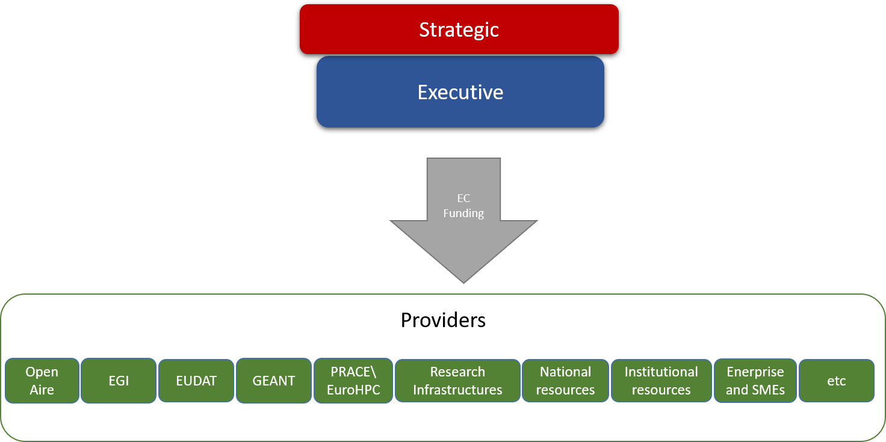
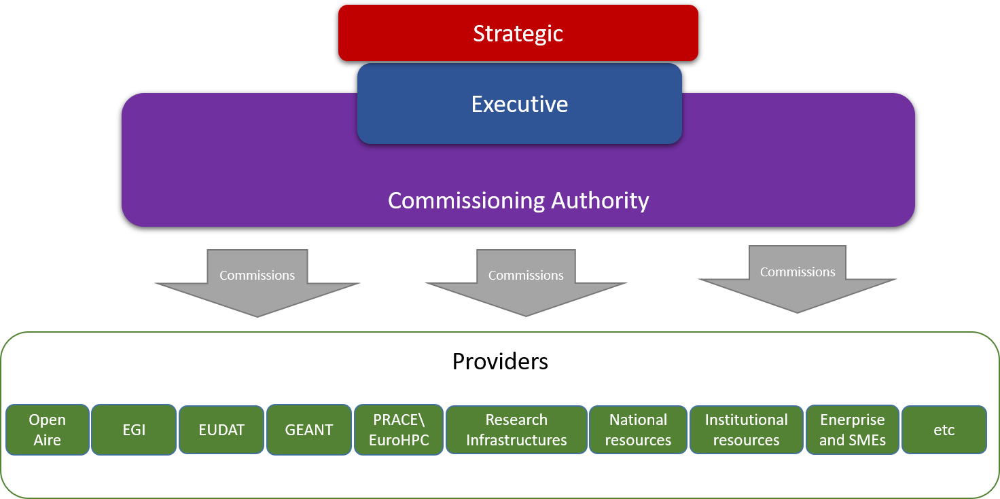
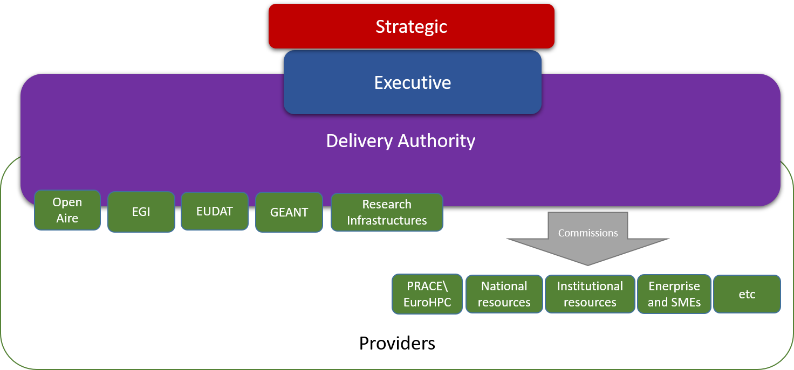

EOSC Resource Delivery Models
------------------------------------------------

There are broadly three different models for the Executive layer to commission and provide financial support to Core and Supported EOSC Resources. Earlier models can be regarded as intermediate steps towards later model as well as potential final models.

## Lightweight Delivery Model
Executive commissions and pays for (either directly or through some compensatory mechanism) Core and Supported services from international, national, institutional and commercial providers through existing mechanisms (e.g. Framework Programme instruments such as Virtual Access) 

 

###Pros
* Minimal Impact on present structures
* Maintains existing entry points
* Maintained Subsidiarity principle (that access should be through local or national institutions)
* Fast to implement
* Present funding mechanisms can be used
* Flexible and agile in terms of providers

## Cons
* Little impact of possibility to change services of present providers
* Slow change cycle
* Would need collaboration agreements

## Commissioning Authority

The establishment of a new entity (possibly a legal structure such as an ERIC) who would have responsibility for commissioning (e.g. contracting or framework agreements) Core and Supported Resources.

 

### Pros
* Clean interface between funder and provider
* From providers’ perspective, a new business opportunity
* An ERIC structure would allow additional mechanisms for Member State contributions

### Cons
* Require major agreement between Member States and European Commission
* Slow to implement
* Breaks Subsidiarity Principle by providing centralised provision of national or local resources

## Delivery Authority

The establishment of a new entity (possibly a legal structure such as an ERIC) who would have responsibility for delivering Core and Supported Resources, either directly or through contracting or framework agreements with third parties.

 

### Pros
* Organisational integration between public European e-infrastructures

### Cons
* Artificially tight integration of very different business models
* Very long time to implement
* Needs strong coordination of national resources
 