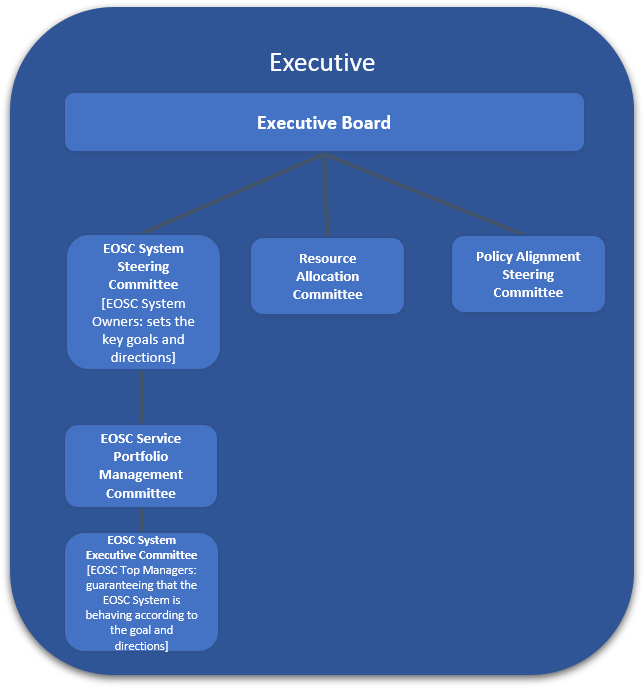

EOSC Executive Governance
--------------

## EOSC Service Portfolio Management Committee

Responsible for the definition and development of the EOSC Service Portfolio - the internal list of EOSC Services including those in preparation, live and discontinued

## EOSC System Steering Committee

Committee of System Ownersi.e. those responsible / accountable for the establishment and maintenance of the EOSC System. steers the EOSC System by setting the key goals and directions. Its tasks include overseeing the development of the EOSC Service Portfolio

## EOSC System Executive Committee

Committee of Top System Managements i.e. those responsible / accountable for the overall operation of the EOSC System. Guarantees that the EOSC System is behaving according to its established goal and directions 
