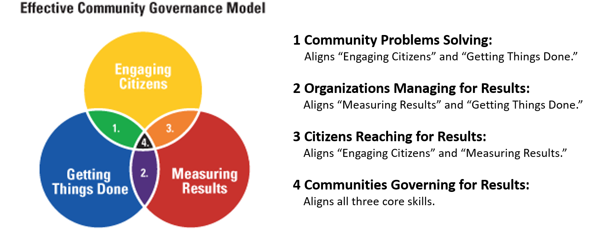
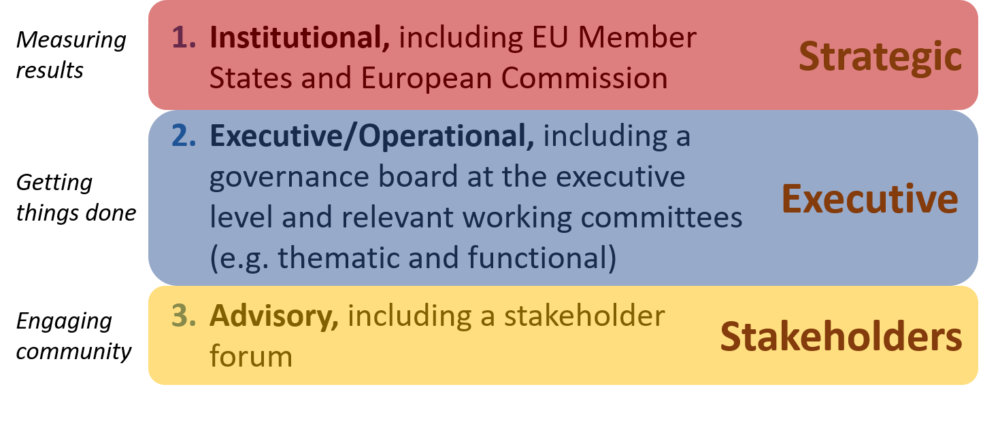
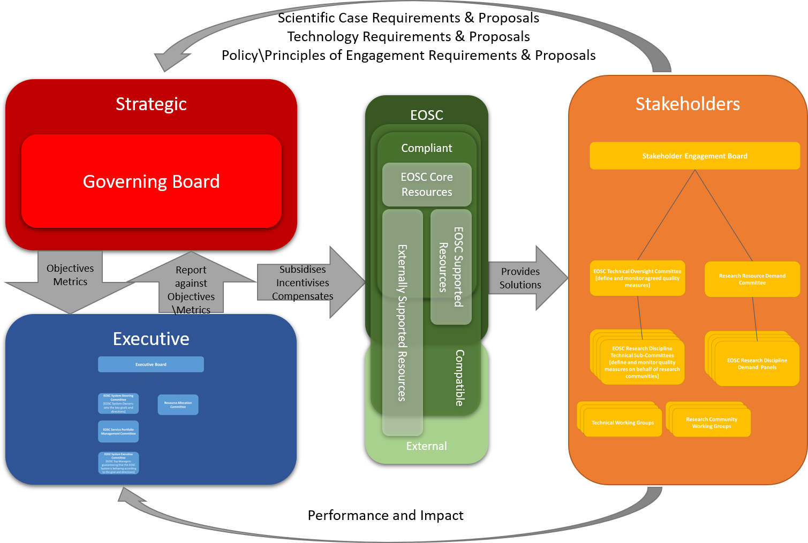
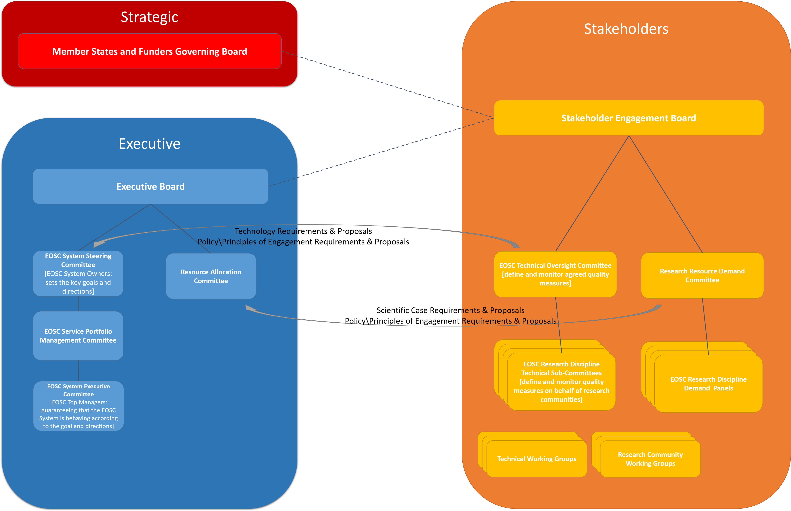

---
title: EOSC Governance Model
menu: Governance Model
weight: 4
---

EOSC Governance Model
---------------------

## Community Lead Governance

The governance model should allow the engagement of all stakeholders, in all stakeholder roles, such that they are peers in the decision making for EOSC. For this, EOSC can borrow from Community Governance in the public sector as typically used for local government or social community initiatives. In this context, Community governance refers to the processes for making all the decisions and plans that affect life in the community, whether made by public or private organisations or by citizens. To be effective, it considers three core community skills of engaging citizens, measuring results, and getting things done in order to help people and organisations make decisions about what actions to take in a community and to measure their impact and effectiveness.  The interaction between these “skills” is shown below. 

 

These map very closely to the layers defined in the EOSC Declaration, nmely those of Institutional, Executive, and Advisory. In this model, the Advisory Layer from the declaration would involve the engaging citizens skills to determine the scientific and technical needs of the users. The term “Advisory” is meant, in this context, to concern engaging with all stakeholders. It is important that stakeholders are, and feel that they are, peers in the decision-making process. They should perform a role that is both advisory and steering – it provides strong guidance and direction (not just advisory) to the Strategic and Executive layers.  

The declaration’s Institutional layer would define the strategic objectives and measure the impact and effectiveness of EOSC against these objectives and so would principally map to the Measuring Results skill. 

Finally, the Executive\Operational layer would map to the Getting Things Done skill by ensuring that the EOSC delivers to meet the needs of the stakeholders through the strategic objectives set by the Institutional layer. These layers are illustrated in Figure 5.

The intersections of these skills and layers are important in delivering an effective governance structure for EOSC. The Stakeholder layer determines within its communities best practice, standards, principles of engagement, in effect addressing the recommendations of “Guidance only where guidance is due” and “Define Principles of Engagement5 for service provision in the EOSC” from the first EOSC HLEG report, as well as the scientific and technical requirements of the EOSC. This forms a discussion and interaction with the Strategic layer, articulates the strategic objectives for the EOSC, and the metrics to measure how well the EOSC delivers against these objectives. This leads to an interaction between the Strategic and Executive layers to determine how the EOSC is provisioned and commissioned to meet these objectives. Finally, there is be a feedback loop between the Steering and Executive on how well the EOSC is meeting the communities’ needs, standards and practices, and a report back from the Executive to the Strategic layer on how effective the EOSC is meeting the strategy, and how effective the strategic goals are at capturing the real needs of the communities. This is outlined below.

 

## Governance Decision Flow

The Stakeholder layer would allow the stakeholders to determine the requirements, policies and principles of engagement, and make proposals on how these could be met to the Strategic Layer. The Strategic layer would review, agree and prioritise these proposals and requirements to form the strategic vision and objectives of the EOSC. 

The Executive layer would be responsible for ensuring that the EOSC meets this vision and these objectives by: commissioning Core resource as required; commissioning new Supported resources as required; ensuring that Supported services are properly compensated; and ensuring that the resources within EOSC are both compliant and meet the strategic objectives.

The Stakeholder layer would also communicate to the Executive at how well the EOSC is meeting their requirements at an operational level, and the Executive would report this against the strategic objective to the Strategic layer.

 
For example, a scientific discipline (or disciplines) within the Steering layer might define data interoperability and re-use principles for data within their domains. The Strategic layer would translate this into strategic objectives and requirements for resource within EOSC which handle such data. The Executive would have responsibility for ensuring such resources existed within EOSC, and would receive input from the Steering layer on how well these resources are in enabling data interoperability and re-use. Alternatively, communities within the Steering layer might identify key areas where training and support are required, the Strategic layer would again translate these to objectives, the Executive would ensure that there were resources within EOSC to meet these training and support requirements, and the Steering would report how effective they are.

## Overall Governance Structure

The Governance Model is derived from the European Interoperability Framework with some slight re-interpretation of the four layers.

* Legal interoperability is about ensuring that organisations operating under different legal frameworks, policies and strategies are able to work together.
* Organisational interoperability refers to the way in which public administrations align their business processes, responsibilities and expectations to achieve commonly agreed and mutually beneficial goals.
* Semantic interoperability ensures that the precise format and meaning of exchanged data and information is preserved and understood throughout exchanges between parties.
* Technical interoperability covers   the   applications   and   infrastructures   linking   systems   and   services.  Aspects of technical interoperability include interface specifications, interconnection services, data integration services, data presentation and exchange, and secure communication protocols.

Within the context of EOSC, Legal Interoperability also includes Policy interoperability, and Rules of Participation for EOSC; and Organisational Interoperability includes both Strategy and Funding. 

Legal, the resource allocation aspects of Organisational, and Technical would form three pillars within the Stakeholder layer, Semantic (in terms of operational implementation of all the EIF layers) would be the responsibility of the Executive which would mirror the structure of the Stakeholder layer. Other strategic aspects of Organisational as well as oversight of all EIF layers would rest within the Strategic layer. 

### Strategic
The Governance Framework foresees EOSC growing beyond Europe and the Strategic Layer growing to include representation from all countries and funders wishing to join and support the EOSC

### Stakeholder
The Stakeholder will include three pillars representing the Technical, Organisational (as regards to resource allocation and demand) and Legal (including policy alignment) layers of the EIF. These would have close working relationships with the relevant pillars of the Executive.
* A Technical Oversight Committee to agree and monitor quality standards for the EOSC Services – this will be informed by research community specific sub-committees
* A Research Resource Demand Committee to have oversight in how EOSC resources are allocated – this will be informed by research community specific panels
* A Policy and Rules of Participation Oversight Committee to recommend research policy alignment – this will be informed by research community specific sub-committees
In addition, it is anticipated that there will be working groups within the stakeholder forum to work on specific aspects of EOSC, in particular for determining future services and developments. These would typically be time limited.

### Executive
The Executive will include representation of those providing EOSC services – both core services essential for the federation of EOSC, and specific and specialized services. It will include three similar pillars to the Stakeholder layer - essentially being providing (in EIF terms) the Semantic (i.e. Operational) implementation of the three pillars in the Stakeholder layer: 
* An operational pillar ensuring that EOSC services meet the needs and standards of the communities consisting of the EOSC System Steering Committee, Service Portfolio Management Committee and EOSC System Executive Committee as defined in the EOSC Architecture and Service Management Framework.
* A Resource Allocation Committee to ensure that communities have appropriate access to scare resources based on research excellence and impact
* A Policy Alignment Steering Committee to ensure necessary alignment of service provider policies both between providers and with national and international policies

Each of these three layers would have a coordinating Board with strong reporting lines between these Boards. However, it is anticipated that there would be other liaison between the layers – in particular the Stakeholder and Executive layers as outlined above.
