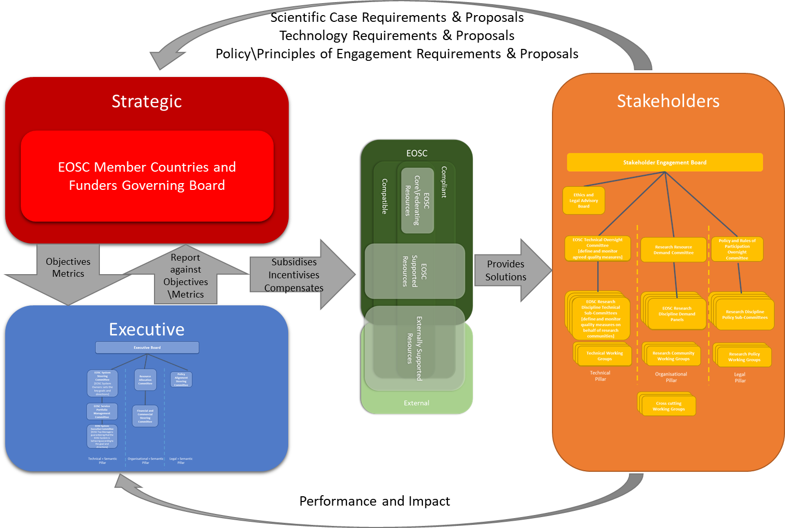

Governance Model
================

Community Lead Governance
-------------------------

Ultimately, the governance model should allow the engagement of all
stakeholders, in all stakeholder roles, such that they are peers in the
decision making for EOSC. For this, EOSC can borrow from Community
Governance in the public sector as typically used for local government
or social community initiatives. In this context, Community governance
refers to the processes for making all the decisions and plans that
affect life in the community, whether made by public or private
organisations or by citizens. To be effective, it considers three core
community skills of *engaging citizens*, *measuring results*, and
*getting things done* in order to help people and organisations make
decisions about what actions to take in a community and to measure their
impact and effectiveness. The interaction between these “skills” is
shown in Figure 8.

Figure 8 - Effective Community Governance[^1]

The EOSC Declaration[^2] defined three governance layers:

-   **Institutional** – including EU Member States and the European
    Commission.

-   **Executive/Operational** – including a governance board at the
    executive level and relevant working committees.

-   **Advisory** – including a stakeholder forum.

These map very closely to the skills in the community governance model
above. In this model, the **Advisory** layer from the declaration would
involve the *engaging citizens* skills to determine the scientific and
technical needs of the users. The term “Advisory” is meant, in this
context, to concern engaging with all stakeholders. It is important that
stakeholders are, and feel that they are, peers in the decision-making
process. They should perform a role that is both advisory and guiding -
it should provide strong guidance and direction (not just advisory) to
the Strategic and Executive layers. Within the EC Staff Working
Document[^3] and the Second HLEG Report[^4] this is referred to as the
**Stakeholder** layer.

The declaration’s **Institutional** layer defines the strategic
objectives and measures the impact and effectiveness of EOSC against
these objectives and so would principally map to the *Measuring Results*
skill. Within the EC Staff Working Document and the Second HLEG Report
this is referred to as the **Strategic** layer.

Finally, the **Executive\\Operational** layer would map to the *Getting
Things Done* skill by ensuring that the EOSC delivers to meet the needs
of the stakeholders through the strategic objectives set by the
Institutional layer. Within the EC Staff Working Document and the Second
HLEG Report this is referred to as the **Executive** layer.

These layers are illustrated in Figure 9.

Figure 9 - EOSC Governance Layers

The intersections of these skills and layers are important in delivering
an effective governance structure for EOSC. The **Stakeholder** layer
determines within its communities’ best practice, standards, rules of
participation, in effect addressing the recommendations of “*Guidance
only where guidance is due”* and “*Define Rules of Participation for
service provision in the EOSC”* from the HLEG group report, as well as
the scientific and technical requirements of the EOSC. This forms a
discussion and interaction with the **Strategic** layer, articulates the
strategic objectives for the EOSC, and the metrics to measure how well
the EOSC delivers against these objectives. This leads to an interaction
between the **Strategic** and **Executive** layers to determine how the
EOSC is provisioned and commissioned to meet these objectives. Finally,
there is be a feedback loop between the **Stakeholder** and
**Executive** on how well the EOSC is meeting the communities’ needs,
standards and practices, and a report back from the **Executive** to the
**Strategic** layer on how effective the EOSC is meeting the strategy,
and how effective the strategic goals are at capturing the real needs of
the communities. This is outlined in Figure 10.

Figure 10 - Community Governance Model for EOSC

Decision Flow
-------------

The overall decision flow between these layers is outlined in Figure 11
(the structures within the layers is elaborated on in the next section
on Governance Structure).

-   The **Stakeholder** layer would allow the stakeholders to determine
    the requirements, policies and Rules of Participation, and make
    proposals on how these could be met to the **Strategic** Layer. The
    **Strategic** layer would review, agree and prioritise these
    proposals and requirements to form the strategic vision and
    objectives of the EOSC.

-   The **Executive** layer would be responsible for ensuring that the
    EOSC meets this vision and these objectives by: commissioning Core
    resource as required; commissioning new Supported resources as
    required; ensuring that Supported resources are properly
    compensated; and ensuring that the resources within EOSC are both
    compliant and meet the strategic objectives.

-   The **Stakeholder** layer would also communicate to the
    **Executive** how well the EOSC is meeting their requirements at an
    operational level, and the **Executive** would report this against
    the strategic objective to the Strategic layer.

For example, a scientific discipline (or disciplines) within the
**Stakeholder** layer might define data interoperability and re-use
principles for data within their domains. The **Strategic** layer would
translate this into strategic objectives and requirements for resource
within EOSC which handle such data. The **Executive** would have
responsibility for ensuring such resources existed within EOSC, and
would receive input from the **Stakeholder** layer on how well these
resources are in enabling data interoperability and re-use.
Alternatively, communities within the **Stakeholder** layer might
identify key areas where training and support are required, the
**Strategic** layer would again translate these to objectives, the
**Executive** would ensure that there were resources within EOSC to meet
these training and support requirements, and the **Stakeholder** would
report how effective they are.

Figure 11 - Governance Decision Flow

[^1]: <http://www.rtmteam.net/page.php?pageID=25&section=overview_of_ecg>

[^2]: <https://ec.europa.eu/research/openscience/pdf/eosc_declaration.pdf>

[^3]: <http://ec.europa.eu/research/openscience/pdf/swd_2018_83_f1_staff_working_paper_en.pdf>

[^4]: <https://publications.europa.eu/en/web/eu-law-and-publications/publication-detail/-/publication/5253a1af-ee10-11e8-b690-01aa75ed71a1>

