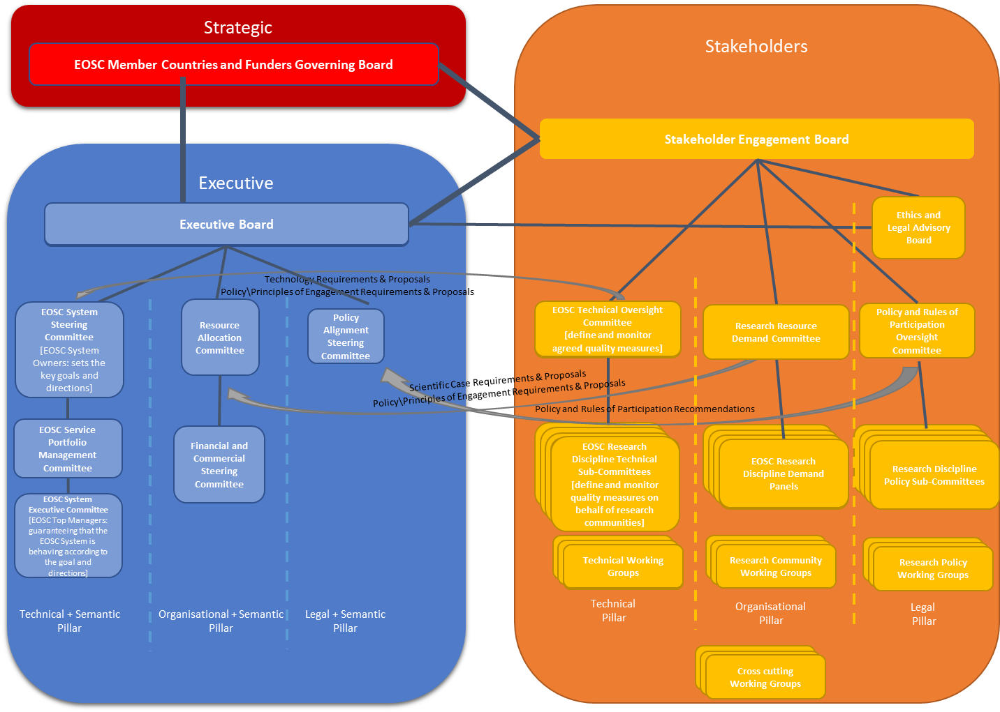

Governance Structure
====================

Overall Structure
-----------------

The European Interoperability Framework

-   **Legal Interoperability** is about ensuring that organisations
    operating under different legal frameworks, policies and strategies
    are capable to work together.

-   **Organisational Interoperability** refers to the way in which
    public administrations align their business processes,
    responsibilities and expectations to achieve commonly agreed and
    mutually beneficial goals.

-   **Semantic Interoperability** ensures that the precise format and
    meaning of exchanged data and information is preserved and
    understood throughout exchanges between parties.

-   **Technical Interoperability** covers the applications and
    infrastructures linking systems, services and resources. Aspects of
    technical interoperability include interface specifications,
    interconnection services, data integration services, data
    presentation and exchange, and secure communication protocols.

Figure 12 - European Interoperability Layers

The Governance Model is derived from the European Interoperability
Framework with some slight re-interpretation of the four layers, as
illustrated in Figure 15; within the context of EOSC**, Legal
Interoperability** also includes Policy interoperability as well as
Rules of Participation for EOSC; and **Organisational Interoperability**
includes both Strategy and Funding.

Currently, the Rules of Participation (RoP) are broad and can cover
different aspects. It currently focuses on rules and guidelines for
resource organisations to promote and offer resources through the EOSC
Catalogue Marketplace. In the evolution of the EOSC Portal, the
Governance model will need to address how Resource Organisations might
need to define their Rules of Participation when they may appear in many
different services catalogues (e.g. at a national or institutional
level) with different RoP whilst remaining “compliant” within the EOSC
Service Catalogue/Marketplace.

**Legal**, the resource allocation aspects of **Organisational**, and
**Technical** would form three pillars within the Stakeholder layer,
**Semantic** (in terms of operational implementation of all the EIF
layers) would be the responsibility of the Executive which would mirror
the three pillars of the Stakeholder layer. Other strategic aspects of
**Organisational** as well as oversight of all EIF layers would rest
within the Strategic layer. The overview of these layer and pillars is
shown in Figure 16, and outlined in Table 8.

Figure 13 - Overall Governance Structure

<table>
<thead>
<tr class="header">
<th><strong>Strategic</strong></th>
<th>The Governance Framework foresees EOSC growing beyond Europe and the Strategic Layer growing to include representation from all countries and funders wishing to join and support the EOSC</th>
</tr>
</thead>
<tbody>
<tr class="odd">
<td><strong>Stakeholder</strong></td>
<td>
The Stakeholder will include three pillars representing the <strong>Technical</strong>, <strong>Organisational</strong> (as regards to resource allocation and demand) and <strong>Legal</strong> (including policy alignment) layers of the EIF. These would have close working relationships with the relevant pillars of the Executive.

<ul>
<li>
A Technical Oversight Committee to agree and monitor quality standards for the EOSC Resources – this will be informed by research community specific sub-committees
</li>
<li>
A Research Resource Demand Committee to have oversight in how EOSC resources are allocated – this will be informed by research community specific panels
</li>
<li>
A Policy and Rules of Participation Oversight Committee to recommend research policy alignment – this will be informed by research community specific sub-committees
</li>
</ul>

There would also be a Ethics and Legal Advisory Board within the Legal pillar reporting directly to the Stakeholder Engagement Board and with close liaison to the Executive Board

It is anticipated that there will be working groups within the stakeholder forum both within these pillars, and cross-cutting working groups, to work on specific aspects of EOSC, in particular for determining future resources and developments. These would typically be time limited.
</td>
</tr>
<tr class="even">
<td><strong>Executive</strong></td>
<td>
The Executive will include representation of those providing EOSC resources – both core resources essential for the federation of EOSC, and specific and specialized resources. It will include three similar pillars to the Stakeholder layer - essentially being providing (in EIF terms) the Semantic (i.e. Operational) implementation of the three pillars in the Stakeholder layer:

<ul>
<li>
A <strong>Technical</strong> <strong>Operational</strong> (<strong>Semantic</strong>) pillar ensuring that EOSC resources meet the needs and standards of the communities consisting of the EOSC System Steering Committee, Service Portfolio Management Committee and EOSC System Executive Committee as defined in the EOSC Architecture and Service Management Framework.
</li>
<li>
An <strong>Organisational</strong> <strong>Operational</strong> (<strong>Semantic</strong>) including a Resource Allocation Committee to ensure that communities have appropriate access to scare resources based on research excellence and impact, and a Financial and Commercial Steering Committee to oversee financial flows and procurement of resources
</li>
<li>
A <strong>Legal Operational</strong> (<strong>Semantic</strong>), including a Policy Alignment Steering Committee to ensure necessary alignment of resource provider policies both between providers and with national and international policies
</li>
</ul></td>
</tr>
</tbody>
</table>

Table 6 - Governance Structure Layers

Each of these three layers would have a coordinating Board with strong
reporting lines between these Boards. However, it is anticipated that
there would be other liaison between the layers – in particular, between
the Stakeholder and Executive layers as outlined above.

Strategic Governance
--------------------

Figure 14 - Strategic Governance

As the Strategic Governance (Figure 17) should involve the
representatives of national policy and national funding agencies, we
believe that the European Commission and its existing structures should
inform the exact nature of this structure. It is possible, for example,
that this might be a task for an existing structure such as the ERAC.
However, we do foresee that the EOSC might grow beyond Europe, and hence
the governing board should include representation from all countries
wishing to join and support the EOSC – hence the reference to **EOSC
member countries** rather than **EU member countries**.

Stakeholder Governance
----------------------

### Governance Structure

Figure 15 - Stakeholder Governance

A recommendation from the EOSC 2^nd^ HLEG would be to have the
Stakeholders Forum should move its focus in 2019 to responding to a user
centred approach and guaranteeing a: **“Voice of the Users”** with
practical cases of how EOSC is making a difference to “how things were
done previously” for them in their thematic area.

The Stakeholder forum (Figure 18) would have three key pillars,
approximately mapping to the EIF layers of **Technical**,
**Organisational** and **Legal** respectively:

-   A **Technical Oversight Committee** to agree and monitor quality
    standards for the EOSC Resources. It would handle quality assignment
    requests, and quality measure monitoring, liaising closely with the
    EOSC System Steering Committee and overseeing the scientific
    discipline technical subcommittees. The team will rely on
    internationally set standards that can be audited by external
    parties and relies on their input for quality assignment. They will
    also keep track of resource and service quality monitoring. It would
    be informed by research community specific sub-committees, which
    would define and check quality measures on behalf of research
    communities. This would be formed by any community that can sustain
    such an effort for longer periods of time. They will report to the
    EOSC TC but assign and maintain quality measures independently.

-   A **Research Resource Demand Committee** to have oversight in how
    EOSC resources are allocated – this will be informed by research
    community specific panels

-   A **Policy and Rules of Participation Oversight Committee** to
    recommend research policy alignment – this will be informed by
    research community specific sub-committees. This would subsume the
    stakeholder policy related aspects of the Policy Standing Committee
    proposed in the EOSCPilot policy recommendations[^1] after the
    initial implementation period of the EOSC.

In addition, the **Legal** pillar would also include an Ethics and Legal
Advisory Board[^2] whose mandate would be to identify ethical and legal
and policy issues to review the actions of EOSC from an ethical and
legal perspective, as well as acting as the source of further ethical
and legal initiatives within the organisation. This would sit in the
Stakeholder forum, reporting to the Stakeholder Engagement Board to
ensure its independence but would have a close advisory and liaison line
into the Executive Board.

### Supporting Structures

The European Interoperability Framework includes the concept of
overlapping domains and this can be used to understand how different
communities would need to interact. This can be applied to scientific
and research domains, comparable to the Domain Interoperability
Frameworks in the diagram (Figure 19). Each scientific domain has its
own best practices and standards, and the role of EOSC is to determine
and coordinate the overlap between these different domains. In this way,
it provides “guidance only where guidance is due”. It also applies to
how different providers and intermediaries should engage with the EOSC
Governance, in that it is the intersection of practices and standards
between International, National and Local provision of resources which
is important for EOSC. This is the principle behind the various
subcommittees and panels within the three pillars.

Figure 16 - European Interoperability Framework Domains of Domains

There are a number of models used in other organisations which were
considered in structuring the Stakeholder Model. Examples include the
IETF (for internet standards), RDA (for Research Data Management), WISE
Community (for e-infrastructure security), OASIS (for Web Service and
metadata standards) and W3C (for Web standards). The main differences
between these concern their legal and financial structures, but in terms
of governance, they can broadly be modelled to two or more of the levels
outlined in Figure 20 below.

Figure 17 - Stakeholders Forum Organisational Model

This model includes:

-   Oversight, e.g. a board or committees that agrees the rules of
    membership, engagement and processes and acts as the key contact
    point with the Strategic and Executive layers.

-   Standing Groups, e.g. for Thematic Areas, either based on the
    Interoperability Contexts, the Stakeholder Roles or broad scientific
    or infrastructure domains, dealing with specific thematic domains.

-   Working Groups, that are time based, work on specific areas with the
    priorities determined by the Stakeholder forum governance in
    conjunction with the Strategic and Executive layers of the EOSC
    Governance.

-   Emergent Topic Groups discuss new activities which may lead to
    working groups.

Table 9 below illustrates how various community organisations map to
this model.

|                           | IETF                                                   | RDA                                                              | WISE               | OASIS                                        | W3C                                            |
|---------------------------|--------------------------------------------------------|------------------------------------------------------------------|--------------------|----------------------------------------------|------------------------------------------------|
| **Oversight**             | Internet Architecture Board                            | Council, Technical Advisory Board, Organisational Advisory Board | Steering Committee | Board, Technical Advisory Board              | Technical Architecture Group, Advisory Board   |
| **Standing Groups**       | Internet Engineering Steering Group and Area Directors | Interest Groups                                                  | N/A                | Member Sections                              | Interest Groups, Business and Community Groups |
| **Working Groups**        | Working Groups                                         | Working Groups                                                   | Working Groups     | Technical Committees                         | Working Groups                                 |
| **Emergent Topic Groups** | Birds of a Feather (BOF) session at an IETF meeting    | Birds of a Feather (BOF) session at an RDA meeting               | N/A                | Proposed Technical Committee Discussion List | Discussion Lists                               |

Table 7 - Community Organisation Structures

Within the Stakeholder Mode, Oversight is provided by the Stakeholder
Engagement Board, and Standing Groups by the various pillars. However,
it is also foreseen that the Stakeholder Model needs time limited
working groups to ensure future development and evolution of EOSC in
additional.

In terms of organisational or legal structure, the Stakeholder
engagement forum should be open to all stakeholders and should borrow
from structures such as RDA or open source foundation models.

Any structure for the Stakeholders Forum should use the key principles
of ISO 38500 (Governance of IT) as guiding principles, namely:

-   **Responsibility** – Stakeholders know their responsibilities, both
    in terms of demand and supply of EOSC resources and have the
    authority to meet them.

-   **Strategy** – Business and funding strategies should be aligned
    with technological possibilities, and all the technologies and
    resources within EOSC within an organisation should support the EOSC
    objectives and strategies.

-   **Acquisition** – all investments must be made based on a research
    case with regular monitoring in place to assess whether the
    assumptions still hold.

-   **Performance** – the performance of EOSC resources should lead to
    research benefits and therefore it is necessary that the resources
    support research properly.

-   **Conformance** – EOSC resources should help to ensure that research
    processes comply with legislation and regulations; EOSC resource
    themselves must also comply with legal requirements and agreed
    internal rules.

-   **Human behaviour** –policies, practices and decisions respects
    human behaviour and acknowledges the needs of all the people in the
    process.

Underpinning this, there may need to be a legal structure such as a
charity, and a secretariat or other supporting agency which might be
shared with the Executive, however, the independence of the Stakeholder
Engagement Forum is paramount.

Executive Governance
--------------------

### Governance Structure

Figure 18 - Executive Governance

The Executive Governance (Figure 21) would have three key pillars,
approximately mapping to the EIF layers of **Technical**,
**Organisational** and **Legal** respectively, in a **Semantic** (i.e.
Operational sense), as outlined in Table 10 below:

<table>
<thead>
<tr class="header">
<th><strong>Technical + Semantic Pillar</strong></th>
<th>
<strong>EOSC System Steering Committee</strong>

Committee of System Owners as defined in the EOSC Architecture<a href="#fn1" class="footnote-ref" id="fnref1">1</a> i.e. those responsible / accountable for the establishment and maintenance of the EOSC System. steers the EOSC System by setting the key goals and directions. Its tasks include overseeing the development of the EOSC Service Portfolio.

<strong>EOSC Service Portfolio Management Committee</strong>

As defined in the EOSC Service Management Framework<a href="#fn2" class="footnote-ref" id="fnref2">2</a> - responsible for the definition and development of the EOSC Service Portfolio - the internal list of EOSC Services and Resources including those in preparation, live and discontinued

<strong>EOSC System Executive Committee</strong>

Committee of Top System Managements as defined in the EOSC Technical Architecture<a href="#fn3" class="footnote-ref" id="fnref3">3</a> i.e. those responsible / accountable for the overall operation of the EOSC System. Guarantees that the EOSC System is behaving according to its established goal and directions
</th>
</tr>
</thead>
<tbody>
<tr class="odd">
<td><strong>Organisational + Semantic Pillar</strong></td>
<td>
<strong>Resource Allocation Committee</strong>

To ensure that communities have appropriate access to scarce resources based on research excellence and impact

<strong>Finance &amp; Commercial Steering Committee</strong>

Oversee financial aspects of EOSC including procuring and supporting key EOSC resources
</td>
</tr>
<tr class="even">
<td><strong>Legal + Semantic Pillar</strong></td>
<td>
<strong>Policy Alignment Steering Committee</strong>

To ensure necessary alignment of service and resource provider policies both between providers and with national and international policies. This would subsume the operational policy related aspects of the Policy Standing Committee proposed in the EOSCPilot policy recommendations<a href="#fn4" class="footnote-ref" id="fnref4">4</a> after the initial implementation period of the EOSC.
</td>
</tr>
</tbody>
</table>
<section class="footnotes">

<ol>
<li id="fn1">
EOSCPilot D5.1: Initial EOSC Service Architecture – available from https://www.eoscpilot.eu/media/deliverables<a href="#fnref1" class="footnote-back">↩</a>
</li>
<li id="fn2">
EOSCPilot D5.3: EOSC Federated Service Management Framework available from https://www.eoscpilot.eu/media/deliverables<a href="#fnref2" class="footnote-back">↩</a>
</li>
<li id="fn3">
EOSCPilot D5.1: Initial EOSC Service Architecture – available from https://www.eoscpilot.eu/media/deliverables<a href="#fnref3" class="footnote-back">↩</a>
</li>
<li id="fn4">
EOSCPilot D3.5: Final Policy Recommendations - available from https://www.eoscpilot.eu/media/deliverables<a href="#fnref4" class="footnote-back">↩</a>
</li>
</ol>
</section>

Table 8 - Executive Governance Pillars

### Supporting Structures

There are broadly three potential models for the EOSC to commission and
provide financial support to Core and Supported EOSC Resources. Each
model can be regarded as both an intermediate step towards more
complicated models as well a potential end state. Each model may be
supported by a legal structure (such as an ERIC) and a secretariat or
other supporting agency which might be shared with the Stakeholder
Engagement Forum.

#### Lightweight Delivery Model

Executive commissions and pays for (either directly or through some
compensatory mechanism) Core and Supported resources from international,
national, institutional and commercial providers through existing
mechanisms (e.g. Framework Programme instruments such as Virtual Access)

Figure 19 – Light Weight Executive Delivery Model

<table>
<thead>
<tr class="header">
<th><strong>Pros</strong></th>
<th><strong>Cons</strong></th>
</tr>
</thead>
<tbody>
<tr class="odd">
<td>
Minimal Impact on present structures

Maintains existing entry points

Maintained Subsidiarity principle (that access should be through local or national institutions)

Fast to implement

Present funding mechanisms can be used

Flexible and agile in terms of providers
</td>
<td>
Little impact of possibility to change resources of present providers

Slow change cycle

Would need collaboration agreements
</td>
</tr>
</tbody>
</table>

Table 1 – Light Weight Executive Delivery Model: Pros and Cons

#### Commissioning Authority

The establishment of a new entity (possibly a legal structure such as an
ERIC) who would have responsibility for commissioning (e.g. contracting
or framework agreements) Core and Supported Resources.

Figure 20 - Commissioning Authority

<table>
<thead>
<tr class="header">
<th>Pros</th>
<th>Cons</th>
</tr>
</thead>
<tbody>
<tr class="odd">
<td>
Clean interface between funder and provider

From providers’ perspective, a new business opportunity

An ERIC structure would allow additional mechanisms for Member State contributions/
</td>
<td>
Require major agreement between Member States and European Commission

Slow to implement

Breaks Subsidiarity Principle by providing centralised provision of national or local resources
</td>
</tr>
</tbody>
</table>

Table 2 – Commissioning Authority: Pros and Cons

#### Delivery Authority

The establishment of a new entity (possibly a legal structure such as an
ERIC) who would have responsibility for delivering Core and Supported
Resources, either directly or through contracting or framework
agreements with third parties.

Figure 21 – Delivery Authority

<table>
<thead>
<tr class="header">
<th>Pros</th>
<th>Cons</th>
</tr>
</thead>
<tbody>
<tr class="odd">
<td>Organisational integration between public European e-infrastructures</td>
<td>
Artificially tight integration of very different business models

Very long time to implement

Needs strong coordination of national resources
</td>
</tr>
</tbody>
</table>

Table 3 - Delivery Authority: Pros and Cons

[^1]: EOSCPilot D3.5: Final Policy Recommendations - available from
    https://www.eoscpilot.eu/media/deliverables

[^2]: Implementing Action 1.4 from EOSCPilot D3.6: Final Policy
    Recommendations - available from
    https://www.eoscpilot.eu/media/deliverables

