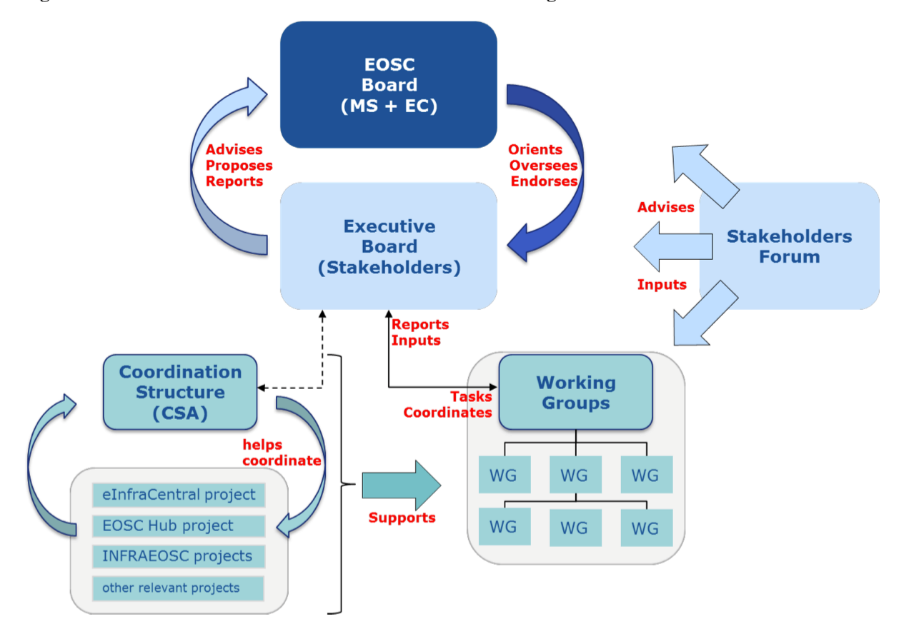
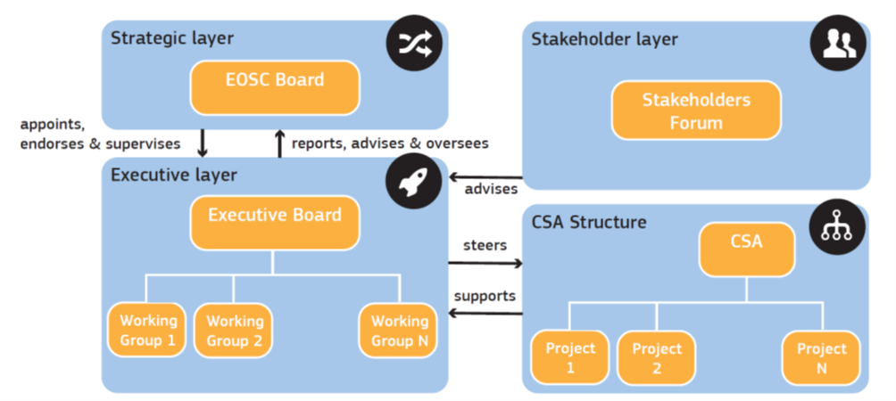
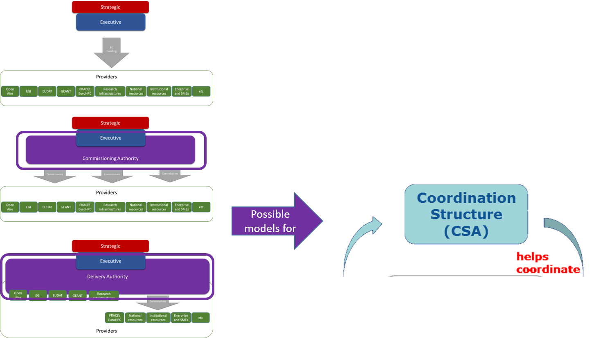

Governance Transition 
======================

The European Commission’s staff working document **"Implementation
Roadmap for the European Open Science Cloud"**[^1] outlines an interim
governance structure for the initial implementation phase of the EOSC:

Figure 22 - Staff Working Document Governance Structure

The report of the Second High Level Expert Group on the Open Science
Cloud (Prompting an EOSC in Practice)[^2], provides an alternative
overview of this interim governance structure:

Figure 23 - 2nd HLEG Report Governance Overview

There are three main differences between these this interim governance
structure and the framework described in this document:

-   As regards the **Strategic** layer, the Staff Working Document is
    very careful to detail the EOSC Board - they are the decision-making
    body and they also decide who is in the Executive board and who is
    in the Stakeholder layer.

-   The Staff Working Document sees the working groups as part of the
    **Executive** layer, whereas the EOSCpilot model sees these as part
    of the **Stakeholder** layer with a much greater independence for
    the Stakeholder layer to self-organise and self-populate.

-   The Staff Working Document has very little to say about the
    **Stakeholder** layer apart from the role in the Strategic in
    determining its membership, apparently minimizing the importance of
    the stakeholder forum. The EOSCpilot framework emphasizes their
    importance puts a lot of emphasis on the relationships and
    information flow, the communication between the layers.

A more detailed comparison

<table>
<thead>
<tr class="header">
<th><strong> </strong></th>
<th><strong>EC Staff Working Document Governance Structure</strong></th>
<th><strong>EOSCpilot Governance Framework</strong></th>
</tr>
</thead>
<tbody>
<tr class="odd">
<td><strong>STRATEGIC</strong></td>
<td>Members: MS + EC (DG RTD and DG CNECT)</td>
<td>Members: MS + EC</td>
</tr>
<tr class="even">
<td></td>
<td>
Function:

<ul>
<li>
ensures effective supervision of the implementation
</li>
<li>
decides strategic orientation of EOSC and commitment and financial support
</li>
<li>
institutional and political oversight
</li>
<li>
approves members of Executive Board
</li>
<li>
approves annual workplan
</li>
<li>
assesses progress of EOSC implementation
</li>
</ul>
<ul>
<li>
coordinates with other MS/EC initiatives
</li>
</ul></td>
<td>
Function:

<ul>
<li>
defines strategic objectives
</li>
<li>
measure the impact and effectiveness of EOSC
</li>
</ul></td>
</tr>
<tr class="odd">
<td><strong>EXECUTIVE</strong></td>
<td>Members: max. 10 chosen by the EOSC Board from ESFRI infras, eInfras, scientific organisations, university associations etc.</td>
<td>Members: not defined</td>
</tr>
<tr class="even">
<td></td>
<td>
Function:

<ul>
<li>
ensures proper implementation and accountability
</li>
<li>
proposes the strategy &amp; workplan
</li>
<li>
drafts the Rules of Participation
</li>
<li>
oversees and steer the implementation of the workplan together with the working groups (WGs)
</li>
<li>
monitors the implementation of EOSC (by 2020)
</li>
<li>
proposes how broaden user base to public sector and industry
</li>
</ul></td>
<td>
Function:

<ul>
<li>
ensures EOSC delivers to meet the needs of the Stakeholders
</li>
</ul></td>
</tr>
<tr class="odd">
<td><strong>STAKEHOLDERS</strong></td>
<td>Members: broad participation by organisations\institutions\communities (possibly decided by EOSC Board), single representative per organisation\institution\community – requires adherence to the principles of EOSC</td>
<td>Members: individuals including organisations\institutional representatives; multiple subforums (consumers, providers etc.)</td>
</tr>
<tr class="even">
<td></td>
<td>
Function:

<ul>
<li>
Intelligence gathering and Consultative role
</li>
<li>
Expertise but no decision-making body
</li>
</ul></td>
<td>
Function:

<ul>
<li>
Recommends\proposes within communities best practices, standards, Rules of Participation
</li>
<li>
Recommends\proposes “Rules of Participation for service provision in the EOSC” from HLEG group report
</li>
<li>
Recommends\proposes scientific and technical requirements of the EOSC
</li>
</ul></td>
</tr>
</tbody>
</table>

Table 12 - Governance Crosswalk

Despite the differences, there is a clear evolutionary path between the
model in the staff working model and the longer term model described
later in this document, with the Stakeholder Forum evolving to become
more independent and able to take a stronger role in determining the
direction of EOSC to ensure that it that it meets its users’ needs, and,
for the working groups as they move from an implementation focus to move
across under the remit of the Stakeholder Forum to ensure independence
between the advisory and delivery roles. This is illustrated in Figure
24. In the meantime, the Executive evolves to take a much more
operational role taking advice and input from the Stakeholder layer. Its
supporting Coordination Structure would evolve into one of the delivery
models outlined in the framework as illustrated in Figure 25.

Figure 24 - Governance Transition

Figure 25 - Delivery Transition

[^1]: [http://ec.europa.eu/research/openscience/pdf/swd\_2018\_83\_f1\_staff\_workin...](http://ec.europa.eu/research/openscience/pdf/swd_2018_83_f1_staff_working_paper_en.pdf)

[^2]: <https://publications.europa.eu/en/web/eu-law-and-publications/publication-detail/-/publication/5253a1af-ee10-11e8-b690-01aa75ed71a1>

