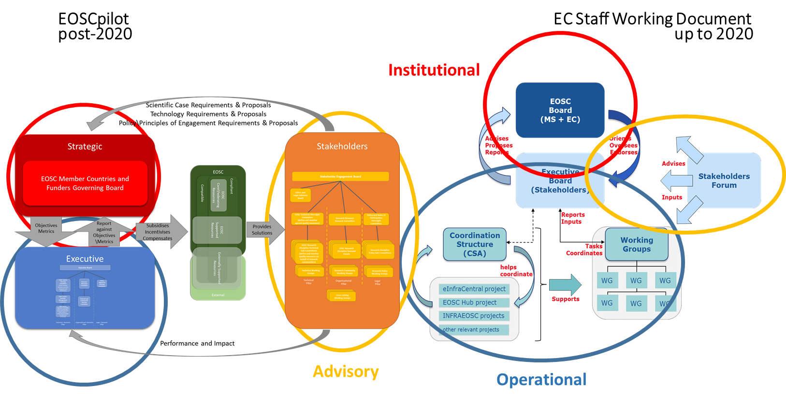

Governance Transition 
======================

EC Staff Working Document
-------------------------

The European Commission’s staff working document **"Implementation
Roadmap for the European Open Science Cloud"**[^1] outlines an interim
governance structure for the initial implementation phase of the EOSC:

Figure 22 - Staff Working Document Governance Structure

The report of the Second High Level Expert Group on the Open Science
Cloud (Prompting an EOSC in Practice)[^2], provides an alternative
overview of this interim governance structure:

Figure 23 - 2nd HLEG Report Governance Overview

There are two main differences between these tise interim governance
structure show above and the framework described in this document

-   one is in the role of the INSTITUTIONAL layer. The SWD is very
    carefully detailing the role of the EOSC Board- they are the
    decision-making body, but they also decide who is in the Executive
    board and who is in the Advisory layer.

-   the second difference is in the importance and the function of the
    advisory layer. While SWD has very little to say about this,
    minimizing the importance of the stakeholder forum, EOSCPilot
    emphasized their importance. EOSCPilot also puts a lot of emphasis
    on the relationships and information flow, the communication between
    the layers.

In addition, EOSCpilot working groups are part of the Stakeholder
Engagement Model created and populated governed by the Stakeholder
Engagement Governance; SWD working groups are part of the Executive
(created and governed by Executive; populated by executive from the
stakeholder forum)

<table>
<thead>
<tr class="header">
<th><strong> </strong></th>
<th><strong>EOSCpilot Governance Framework</strong></th>
<th><strong>EC SWD Governance Structure</strong></th>
</tr>
</thead>
<tbody>
<tr class="odd">
<td><strong>INSTITUTIONAL</strong></td>
<td>Name: Strategic</td>
<td>Name: EOSC Board</td>
</tr>
<tr class="even">
<td></td>
<td>Members: MS + EC</td>
<td>Members: MS + EC (DG RTD and DG CNECT)</td>
</tr>
<tr class="odd">
<td></td>
<td>
Function:

<ul>
<li>
defines strategic objectives
</li>
<li>
measure the impact and effectiveness of EOSC
</li>
</ul></td>
<td>
Function:

<ul>
<li>
ensures effective supervision of the implementation
</li>
<li>
decides strategic orientation of EOSC and commitment and financial support
</li>
<li>
institutional and political oversight
</li>
<li>
approves members of Executive Board
</li>
<li>
approves annual workplan
</li>
<li>
assesses progress of EOSC implementation
</li>
<li>
coordinates with other MS/EC initiatives
</li>
</ul></td>
</tr>
<tr class="even">
<td><strong>EXECUTIVE</strong></td>
<td>Name: Executive</td>
<td>Name: Executive Board (+ Coordination Structure?)</td>
</tr>
<tr class="odd">
<td></td>
<td>Members: not clear</td>
<td>Members: max. 10 chosen by the EOSC Board from ESFRI infras, eInfras, scientific organisations, university associations etc.</td>
</tr>
<tr class="even">
<td></td>
<td>
Function:

<ul>
<li>
ensures EOSC delivers to meet the needs of the Stakeholders
</li>
</ul></td>
<td>
Function:

<ul>
<li>
ensures proper implementation and accountability
</li>
<li>
proposes the strategy &amp; workplan
</li>
<li>
drafts the Rules of Participation
</li>
<li>
oversees and steer the implementation of the workplan together with the working groups (WGs)
</li>
<li>
monitors the implementation of EOSC (by 2020)
</li>
<li>
proposes how broaden user base to public sector and industry
</li>
</ul></td>
</tr>
<tr class="odd">
<td><strong>ADVISORY</strong></td>
<td>Name: Steering (incl. Stakeholder Forum)</td>
<td>Name: Advisory (Stakeholder Forum)</td>
</tr>
<tr class="even">
<td></td>
<td>Members: individuals including organisations\institutional representatives; multiple subforums (consumers, providers etc.)</td>
<td>Members: broad participation by organisations\institutions\communities (possibly decided by EOSC Board), single representative per organisation\institution\community – requires adherence to the principles of EOSC</td>
</tr>
<tr class="odd">
<td></td>
<td>
Function:

<ul>
<li>
Recommends\proposes within communities best practices, standards, Rules of Participation
</li>
<li>
Recommends\proposes “Rules of Participation for service provision in the EOSC” from HLEG group report
</li>
<li>
Recommends\proposes scientific and technical requirements of the EOSC
</li>
</ul></td>
<td>
Function:

<ul>
<li>
Intelligence gathering and Consultative role
</li>
<li>
Expertise but no decision-making body
</li>
</ul></td>
</tr>
</tbody>
</table>

Table 11 - Governance Crosswalk

Despite the differences, there is a clear evolutionary path between the
model in the staff working model and the longer term model described
later in this document, with the Stakeholder Forum taking a stronger
role in determining the direction of EOSC to ensure that it that it
meets its users’ needs, and, in particular, taking over the running of
working groups, whilst the Executive adopts a more operational and
delivery role

Figure 24 - Governance Transition

In addition, the coordinating structure would evolve into a delivery
model for EOSC resources and services.

Figure 25 - Delivery Transition

[^1]: [http://ec.europa.eu/research/openscience/pdf/swd\_2018\_83\_f1\_staff\_workin...](http://ec.europa.eu/research/openscience/pdf/swd_2018_83_f1_staff_working_paper_en.pdf)

[^2]: https://publications.europa.eu/en/web/eu-law-and-publications/publication-detail/-/publication/5253a1af-ee10-11e8-b690-01aa75ed71a1

