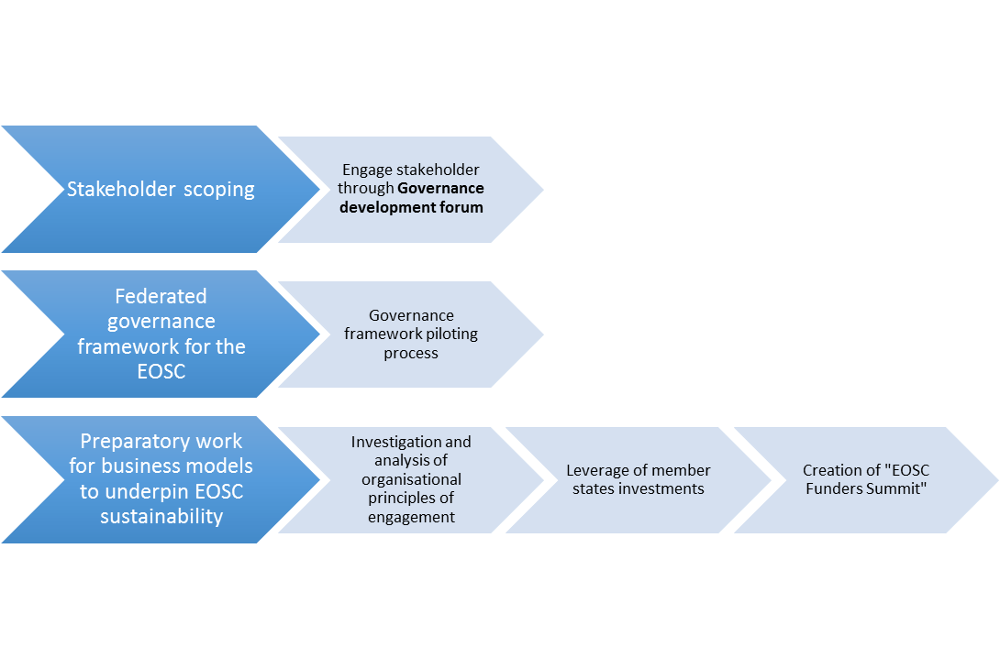
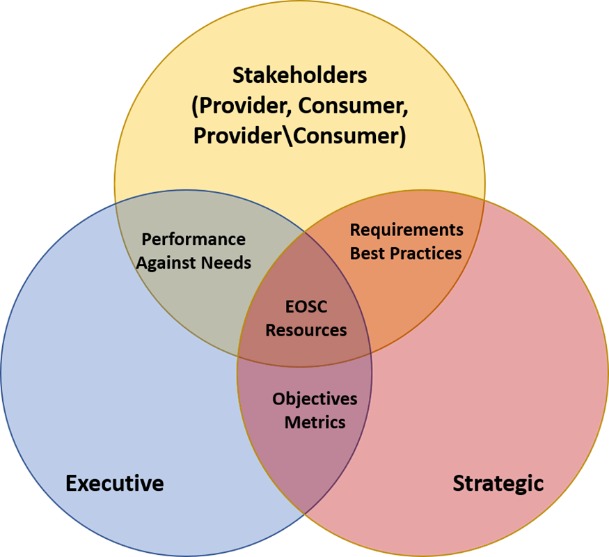

Introduction
============

The EOSCpilot project objectives are to:

-   design and propose a possible governance framework for the EOSC and
    contribute to the development of European open science policy and
    best practice;

-   develop a number of pilots that integrate services and
    infrastructures to demonstrate interoperability in a number of
    scientific domains; and

-   engage with a broad range of stakeholders, crossing borders and
    communities, to build the trust and skills required for adoption of
    an open approach to scientific research

The objective of Work-package 2 is to design and trial a stakeholder
driven governance framework with the involvement of research
communities, research institutions, research infrastructures including
e-infrastructures, and research funding bodies, to shape and oversee
future development of the European Open Science Cloud (EOSC), and to
identify appropriate federated governance model(s) and decision-making
structure for it (see Figure 2).

Figure 2 - EOSCPilot WP2 Governance Outline

As
part of that objective, this document outlines a framework for a
stakeholder driven governance and decision-making structure which could
be used after the initial implementation phase of the EOSC.

The framework outlines:

-   A three-layer governance model consisting of Strategic, Executive
    and Stakeholder layers, and the interactions and decision flow
    between these layers;

-   A resource model for the EOSC, and a skeleton outline of the
    Executive layer’s role in commissioning and supporting the EOSC
    resources;

-   An outline of the role and structure of the Stakeholder layer and
    its interaction with the Executive.

This document is structured as shown in Table 1, below.

| Section                    | Summary                                                                                                                                                                                                 |
|----------------------------|---------------------------------------------------------------------------------------------------------------------------------------------------------------------------------------------------------|
| Strategic Requirements     | Outlines the political and policy context for EOSC and the EOSC Governance framework and structure.                                                                                                     |
| Governance Principles      | Outlines key principles identified from the community and existing work to which any EOSC Governance framework and structures must conform.                                                             |
| Stakeholders and Resources | Outlines the under-pinning models of EOSC stakeholders and EOSC resources and services.                                                                                                                 |
| Governance Model           | Outlines the overall model of the Governance Framework.                                                                                                                                                 |
| Governance Structure       | Elaborates on the structures with the Governance Model.                                                                                                                                                 |
| Governance Transition      | Outlines a transition from the interim Governance structure established by the European Commission for the initial implementation of the EOSC and the longer-term framework described in this document. |

Table 1 - Document Structure

This document is intended to become a living document owned by the
community. For that purpose, the contents of the most up to date version
can be found on github at:

-   **Reading version:**
    <https://europeanopensciencecloud.github.io/Governance/>

-   **Editable version:**
    <https://github.com/EuropeanOpenScienceCloud/Governance/>

