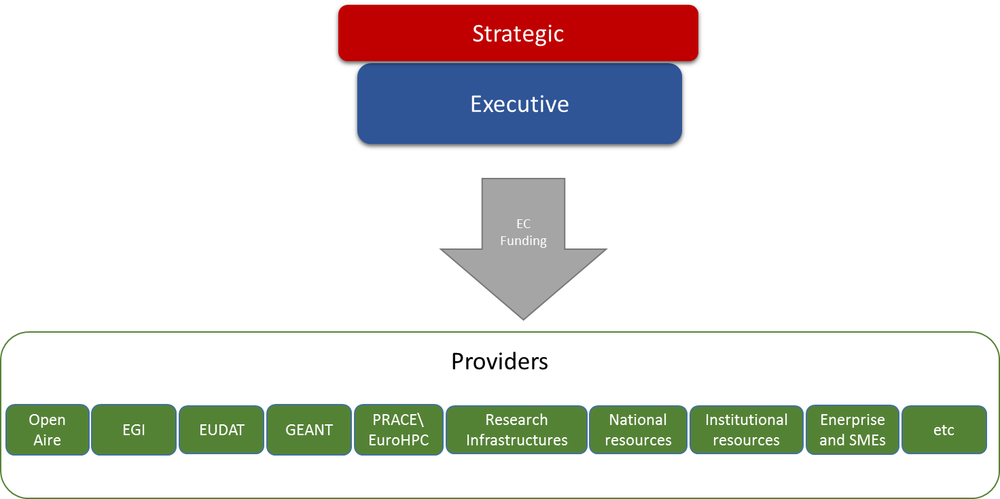
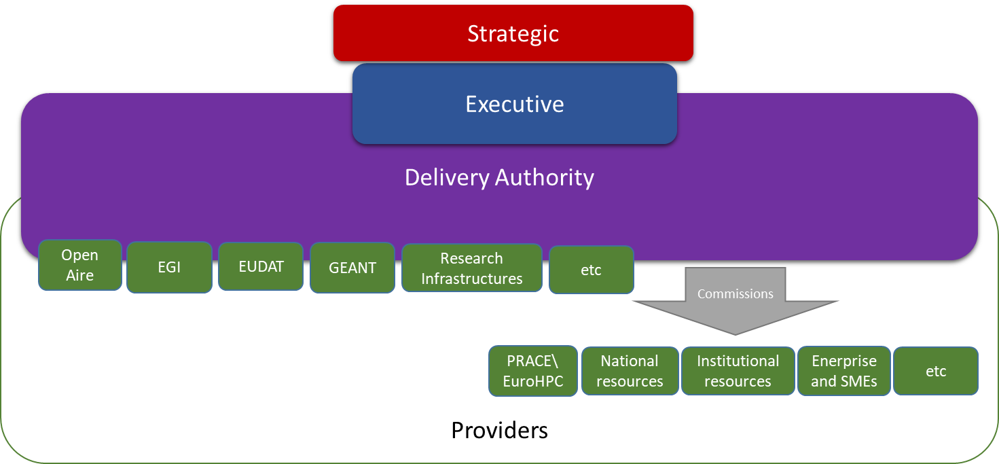

Legal Structures
================

Executive
---------

There are broadly three potential models for the EOSC to commission and
provide financial support to Core and Supported EOSC Resources. Earlier
models can be regarded as intermediate steps towards later model as well
as potential final models.

### Lightweight Delivery Model

Executive commissions and pays for (either directly or through some
compensatory mechanism) Core and Supported resources from international,
national, institutional and commercial providers through existing
mechanisms (e.g. Framework Programme instruments such as Virtual Access)

Figure 19 – Light Weight Executive Delivery Model

<table>
<thead>
<tr class="header">
<th>Pros</th>
<th>Cons</th>
</tr>
</thead>
<tbody>
<tr class="odd">
<td>
Minimal Impact on present structures

Maintains existing entry points

Maintained Subsidiarity principle (that access should be through local or national institutions)

Fast to implement

Present funding mechanisms can be used

Flexible and agile in terms of providers
</td>
<td>
Little impact of possibility to change resources of present providers

Slow change cycle

Would need collaboration agreements
</td>
</tr>
</tbody>
</table>

Table 9 – Light Weight Executive Delivery Model: Pros and Cons

### Commissioning Authority

The establishment of a new entity (possibly a legal structure such as an
ERIC) who would have responsibility for commissioning (e.g. contracting
or framework agreements) Core and Supported Resources.

Figure 20 - Medium Weight Executive Delivery Model

<table>
<thead>
<tr class="header">
<th>Pros</th>
<th>Cons</th>
</tr>
</thead>
<tbody>
<tr class="odd">
<td>
Clean interface between funder and provider

From providers’ perspective, a new business opportunity

An ERIC structure would allow additional mechanisms for Member State contributions/
</td>
<td>
Require major agreement between Member States and European Commission

Slow to implement

Breaks Subsidiarity Principle by providing centralised provision of national or local resources
</td>
</tr>
</tbody>
</table>

Table 10 – Medium Weight Executive Delivery Model: Pros and Cons

### Delivery Authority

The establishment of a new entity (possibly a legal structure such as an
ERIC) who would have responsibility for delivering Core and Supported
Resources, either directly or through contracting or framework
agreements with third parties.

Figure 21 – Heavy Weight Executive Delivery Model

<table>
<thead>
<tr class="header">
<th>Pros</th>
<th>Cons</th>
</tr>
</thead>
<tbody>
<tr class="odd">
<td>Organisational integration between public European e-infrastructures</td>
<td>
Artificially tight integration of very different business models

Very long time to implement

Needs strong coordination of national resources
</td>
</tr>
</tbody>
</table>

Stakeholder Forum
-----------------

