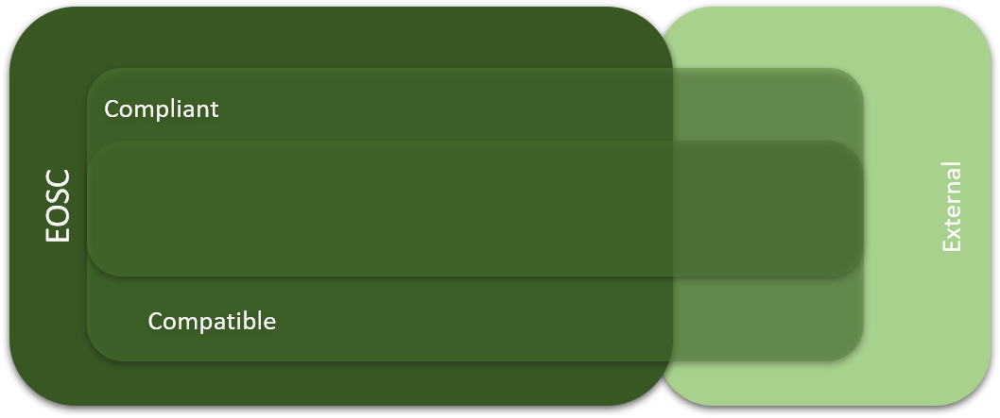
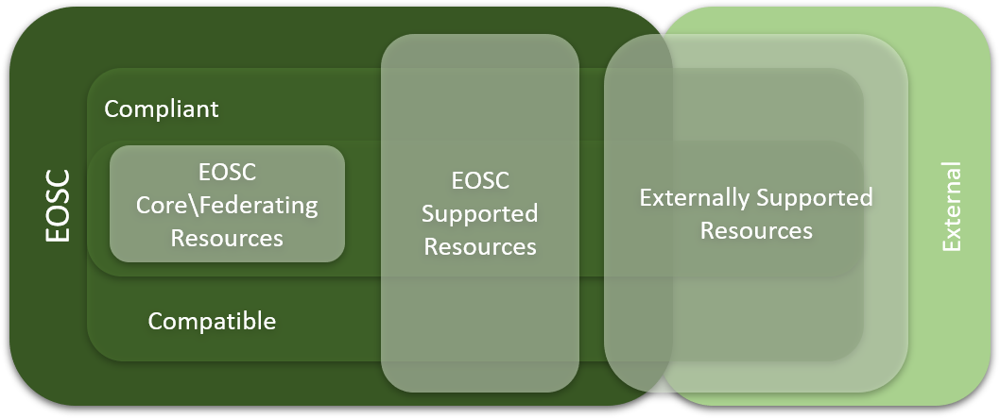

EOSC Resource Model
------------------------------------------------

---
EOSC Resource = Services + Data + People
---

At the centre of this model are the EOSC Resources themselves – the EOSC Resources cover the range of services and facilities needed to support Open Science and Research. These include technical services such as analytics and computational services, cloud services, thematic services tuned to particular research disciplines, e-infrastructure and middleware services such as access identity management; but also knowledge resources such as datasets, storage, digital library and archives; access services such as a service catalogue and portals; scientific instruments and facilities; and facilitation activities such as training, software development support and consultancy.

## Compliance and Compatibility
It is envisaged that most of the EOSC resources will be fully compliant with the Rules of Participation and compatible with the technical architecture. However, it is likely that, at least initially, there will be resources which are not fully compliant but are merely technically compatible with the EOSC but are still of value to the EOSC Consumers. Such resources might meet the needs of specific disciplines only, or may be currently in the process of becoming compliant. 

There may also be some resources which may not be fully technically compatible with EOSC resources nor fully compliant with the Principles of Engagement, but which nevertheless outside are of value to EOSC consumers. These would still be usable by EOSC consumers as recommended by the HLEG that “It should be clear that non-EOSC approved players are free to explore any role in the Open Science ecosystem they wish, even if they do not adhere to the Principles of Engagement. They will just not be able to brand their services as EOSC approved/certified”. 

This is illustrated above. The EOSCPilot is currently co-developing Rules of Participation with the community, as well as developing the technical architecture which will further inform this model in terms of precise definitions of compliant and compatible. It is likely that compliant and compatible will be parts of a broader spectrum of different degrees of technical interoperability and compliance with the Principles of Engagement rather than the binary relationship implied here.

## Core Resources
To function, there will need to be some Core Resources underpinning the EOSC analogous to the Logical Layer in the Digital Governance for the Internet (Figure 3). Such resources might include the EOSC service catalogue, access and identity management, etc. The need for Core Resources was also identified by the OSPP EOSC Working Group (see Section 2.3) whose definition is “set of services and processes that are needed to integrate and enable access to the various resources federated in the EOSC”. The Core Resources will need to be directly commissioned and financially compensated. The Executive should have the primary responsibility, in discussion with the Strategic and Steering layers, to determine the requirements of these core resources, and decide how they will be delivered. 

## Compensation
In order to meet the objective of “free at the point of use”, resource provision will need to be compensated by other means. The EOSCPilot is currently working on Business and Funding Models on how this compensation would work, but various models could include contribution of resources by member states and institutions, direct commission by the Executive or compensation based on usage using mechanism in the Framework Programmes (such as Transnational or Virtual Access instruments ) or new mechanisms such as “Cloud Coins” or other credit mechanisms. Facilities and services to enable such credit mechanisms will need to be provided by the EOSC Core Resources.

## Service Gaps 
To ensure that the EOSC remains relevant and to encourage innovation, it will be necessary to identify any gaps there may be in provision. Gaps may be identified by Steering or Executive layer and notified to the Executive and Strategic layers. The Executive will need to develop mechanisms to fill any such gaps in provision, either by directly incentivising the development of new services or through advocacy to the Strategic layer and the Framework Programmes.

## Open Market
To ensure that EOSC remains "open to all players, public and private, European and non-European", there may also be resources within EOSC which will not be directly compensated through EOSC, but through other means (including commercial resources paid directly by researchers or their institutions), but which nevertheless meet the requirements to be EOSC compliant or compatible and are of value to the community.  

## Summary

In summary:
•	An EOSC Resource is Compliant if it meets the Principles of Engagement and the technical requirements as defined by the EOSC technical architecture
•	An EOSC Resource is Compatible if it meets the technical requirements as defined by the EOSC technical architecture
•	Some resources which are needed to integrate and enable access to the various resources federated in the EOSC will be Core Resources (which by definition will need to be Compliant)
•	Compliant resources will be eligible to be part of EOSC; resources neither Compliant nor Compatible will be external to EOSC; Compatible only resources might be borderline (if, for instance, they are transitioning into EOSC)
•	EOSC resources (both commercial and non-commercial) might be compensated for their usage via mechanisms within EOSC; some EOSC resources might be funded via other means, including commercial models
