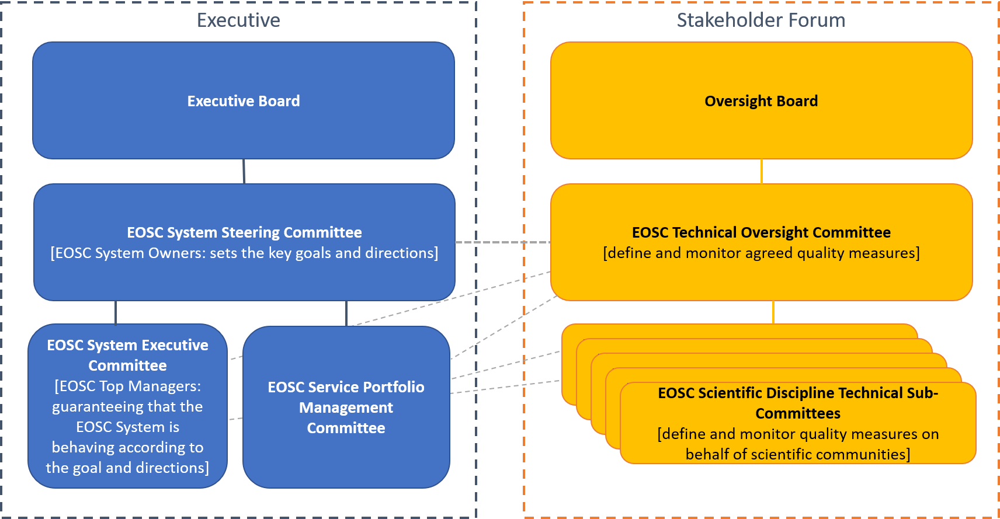

---
title: EOSC Serivce Management Model
menu: Governance Model
weight: 4
---

EOSC Service Management Model
-----------------------------

 

## EOSC Service Portfolio Management Committee

Responsible for the definition and development of the EOSC Service Portfolio - the internal list of EOSC Services including those in preparation, live and discontinued

## EOSC System Steering Committee

Committee of System Ownersi.e. those responsible / accountable for the establishment and maintenance of the EOSC System. steers the EOSC System by setting the key goals and directions. Its tasks include overseeing the development of the EOSC Service Portfolio

## EOSC System Executive Committee

Committee of Top System Managements i.e. those responsible / accountable for the overall operation of the EOSC System. Guarantees that the EOSC System is behaving according to its established goal and directions 

## EOSC Technical Oversight Committee

Handle quality assignment requests, and quality measure monitoring, liaising closely with the EOSC System Steering Committee and overseeing the scientific discipline technical subcommittees. The team will rely on internationally set standards that can be audited by external parties and relies on their input for quality assignment. They will also keep track of service quality monitoring

## EOSC Scientific Discipline Technical Sub-Committees

Multiple committees defining and checking quality measures on behalf of scientific commnunities. Can be formed by any community that can sustain such an effort for longer periods of time. They will report to the EOSC TC but assign and maintain quality measures independently.
