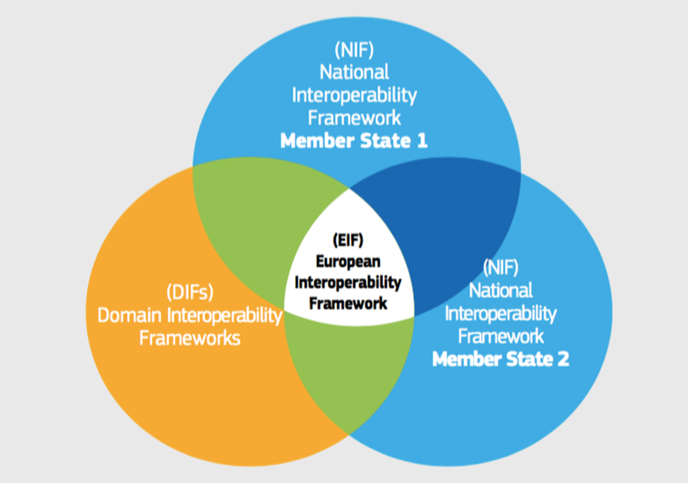
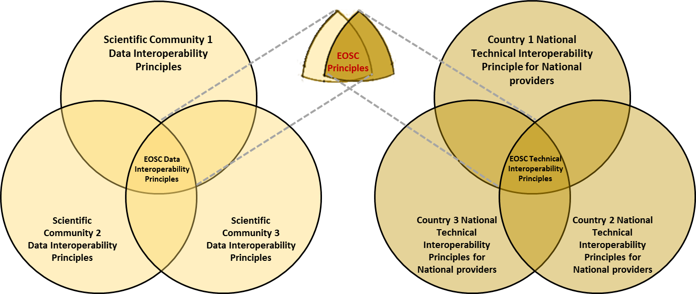
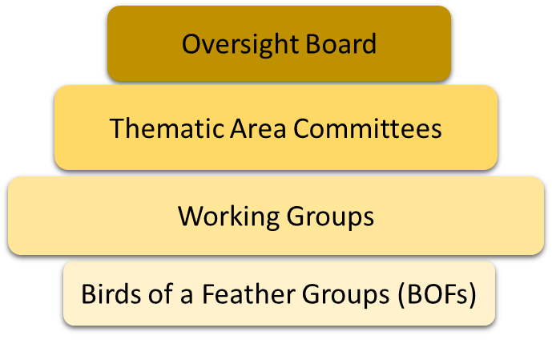

EOSC Stakeholder Forum
----------------------

## Stakeholders

The framework concentrates on three stakeholder roles, understanding that different stakeholders can play multiple roles, or different roles are different points in the research lifecycle or within their organisation.

| Primary Role| Description |
|-------------|-------------|
| **Provider** | Provides services, data or other resources (e.g. scientific instruments, training) into EOSC |
| **Consumer** | Will make use of services, data, or other resources from EOSC |
| **Decision-makers** | Will be involved in the strategic direction, compliance and funding of EOSC |

In addition, there are some additional roles which are covered by the above stakeholders, but worth explicitly articulating.

| Supplementary Role | Description | Relationship to Primary Roles |
|--------------------|-------------|-------------------------------|
| **Consumer-Provider** | Many stakeholders (including e-infrastructures, research infrastructures, VREs etc.) will consume services from some providers to provide value added services to other consumers. | Member of both Provider and Consumer roles |
| **Funder** | Provides funding for research on a local, national or international level | Sub-role within Decision-makers |
| **Policy-makers** | Regulates policy at a local, national or regional level.	Sub-role within Decision-makers |

## Governance
The Stakeholder Forum is a key component of the Steering layer.  The Stakeholder Forum should consist of multiple sub-forums representing the interests of Stakeholder Roles of Consumers and Providers, including those in the supplementary role of Intermediaries. Whilst these might have their own working groups, it is important that there is also cross working between these stakeholder roles.

The structure of the Stakeholder Forum in the Steering layer is key for the Governance Decision Flow Model to be effective, to allow participation from all stakeholders both large and small, and to be open and transparent. To achieve this, any structure for the Stakeholder Forum use the key principles of ISO 38500 (Governance of IT)  as guiding principles, namely:
* Responsibility –Stakeholders know their responsibilities, both in terms of demand and supply of EOSC resources and have the authority to meet them.
* Strategy – Business and funding strategies should be aligned with technological possibilities, and all the technologies and resources within EOSC within an organisation should support the EOSC objectives and strategies.
* Acquisition – all investments must be made based on a research case with regular monitoring in place to assess whether the assumptions still hold.
* Performance – the performance of EOSC resources should lead to research benefits and therefore it is necessary that the resources support research properly.
* Conformance – EOSC resources should help to ensure that research processes comply with legislation and regulations; EOSC resource themselves must also comply with legal requirements and agreed internal rules.
* Human behaviour –policies, practices and decisions respects human behaviour and acknowledges the needs of all the people in the process.

To achieve this, the European Interoperability Framework  (EIF) from the European Commission can be used as a “lens” to understand how different communities should interact and the areas of discourse within these interactions. The EIF derives the need for interoperability between public sector and e-government services and  outlines specific guidance on how to set up interoperable digital public services. 

 
The first part of the lens is the concept of overlapping domains and this can be used to understand how different communities would need to interact. This can be applied to scientific and research domains, comparable to the Domain Interoperability Frameworks in the diagram. Each scientific domain has its own best practices and standards, and the role of EOSC is to determine and coordinate the overlap between these different domains. In this way, it provides “guidance only where guidance is due” (Section 2.2). It also applies to how different providers and intermediaries should engage with the EOSC Governance, in that it is the intersection of practices and standards between International, National and Local provision of resources which is important for EOSC. Finally, the agreements on engagement principles, standards and requirements should be the intersection of those of the different stakeholder roles: Consumer, Provider and Intermediary. This lens is illustrated in Figure 11.

 
A second concept of the lens is the application of Interoperability Contexts which can help frame the topics of discussion and agreement between the different stakeholders on how different infrastructures, scientific domains, providers etc. need to interoperate to develop and deliver the EOSC. The European Interoperability Framework defines four such contexts:
* Legal interoperability is about ensuring that organisations operating under different legal frameworks, policies and strategies are able to work together.
* Organisational interoperability refers to the way in which public administrations align their business processes, responsibilities and expectations to achieve commonly agreed and mutually beneficial goals.
* Semantic interoperability ensures that the precise format and meaning of exchanged data and information is preserved and understood throughout exchanges between parties.
* Technical interoperability covers   the   applications   and   infrastructures   linking   systems   and   services.  Aspects of technical interoperability include interface specifications, interconnection services, data integration services, data presentation and exchange, and secure communication protocols.

Within the context of EOSC, Legal Interoperability also includes Policy interoperability, and Principles of Engagement for EOSC; and Organisational Interoperability includes both Strategy and Funding. Annex B outlines some initial discussions on the responsibilities of different stakeholders, mapped against these contexts as a foundation for further discussions and development.
The Stakeholder Forum would be the organisational structure where the discussions as seen through the EIF lens should take place. There are a number of models used in other organisations which can be considered in structuring the Stakeholder Forum. Examples include the IETF  (for internet standards), RDA  (for Research Data Management), WISE Community  (for e-infrastructure security), OASIS  (for Web Service and metadata standards) and W3C  (for Web standards). The main differences between these concern their legal and financial structures, but in terms of governance, they can broadly be modelled to two or more of the levels outlined in Figure 12.
 

The model includes:
* Oversight, e.g. a board or committees that agrees the rules of membership, engagement and processes and acts as the key contact point with the Strategic and Executive layers.
* Standing Groups, e.g. for Thematic Areas, either based on the Interoperability Contexts, the Stakeholder Roles or broad scientific or infrastructure domains, dealing with specific thematic domains. 
* Working Groups, that are time based, work on specific areas with the priorities determined by the Stakeholder forum governance in conjunction with the Strategic and Executive layers of the EOSC Governance. 
* Emergent Topic Groups discuss new activities which may lead to working groups. 

The table below illustrates how various community organisations map to this model.

|   | IETF | RDA | WISE | OASIS | W3C |
|---|------|-----|------|-------|-----|
| **Oversight** | Internet Architecture Board | Council, Technical Advisory Board, Organisational Advisory Board | Steering Committee | Board, Technical Advisory Board | Technical Architecture Group, Advisory Board |
| **Standing Groups** |	Internet Engineering Steering Group and Area Directors | Interest Groups | N/A | Member Sections | Interest Groups, Business and Community Groups |
| **Working Groups** | Working Groups | Working Groups | Working Groups | Technical Committees | Working Groups |
| **Emergent Topic Groups** | Birds of a Feather (BOF) session at an IETF meeting | Birds of a Feather (BOF) session at an RDA meeting | N/A | Proposed Technical Committee Discussion List | Discussion Lists |
