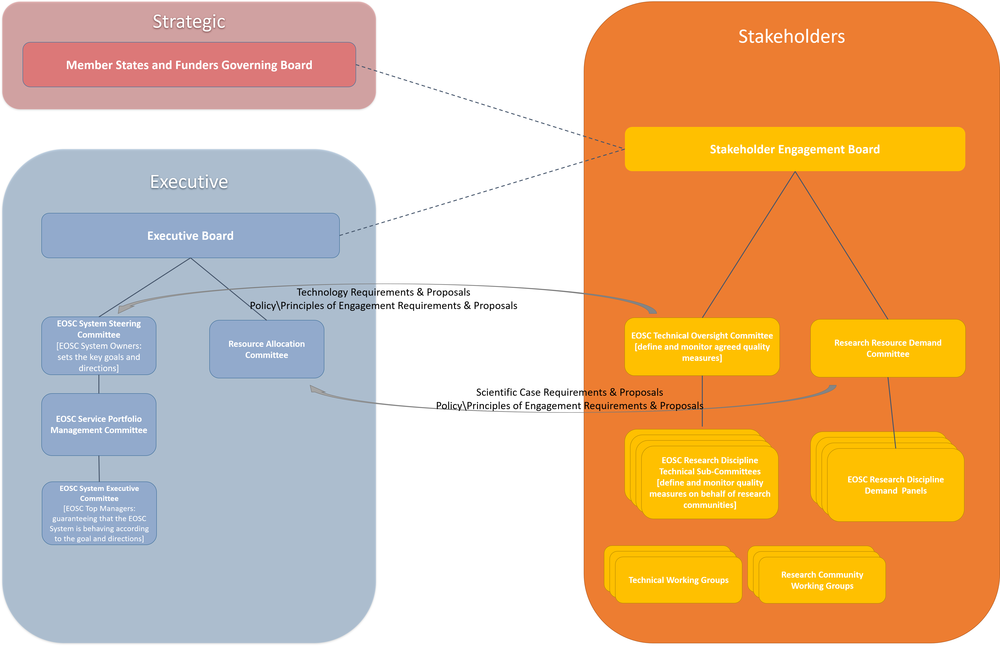

---
title: EOSC Stakeholder Governance
menu: EOSC Stakeholder Governance
parent: GovernanceModel.md
weight: 2
---

EOSC Stakeholder Governance
----------------------

The Stakeholder forum would have three key pillars, approximately mapping to the EIF layers of Technical, Organisational and Legal respectively:

* A Technical Oversight Committee to agree and monitor quality standards for the EOSC Services. It would handle quality assignment requests, and quality measure monitoring, liaising closely with the EOSC System Steering Committee and overseeing the scientific discipline technical subcommittees. The team will rely on internationally set standards that can be audited by external parties and relies on their input for quality assignment. They will also keep track of service quality monitoring. It would be informed by research community specific sub-committees, which would define and check quality measures on behalf of research commnunities. This would be formed by any community that can sustain such an effort for longer periods of time. They will report to the EOSC TC but assign and maintain quality measures independently.
* A Research Resource Demand Committee to have oversight in how EOSC resources are allocated – this will be informed by research community specific panels
* A Policy and Rules of Participation Oversight Committee to recommend research policy alignment – this will be informed by research community specific sub-committees

The European Interoperabiltiy Framework also includes the concept of overlapping domains and this can be used to understand how different communities would need to interact. This can be applied to scientific and research domains, comparable to the Domain Interoperability Frameworks in the diagram. Each scientific domain has its own best practices and standards, and the role of EOSC is to determine and coordinate the overlap between these different domains. In this way, it provides “guidance only where guidance is due”. It also applies to how different providers and intermediaries should engage with the EOSC Governance, in that it is the intersection of practices and standards between International, National and Local provision of resources which is important for EOSC. This is the principle behind the various subcommittees and panels within the three pillars.

There are a number of models used in other organisations which were considerd in structuring the Stakeholder Model. Examples include the IETF  (for internet standards), RDA  (for Research Data Management), WISE Community  (for e-infrastructure security), OASIS  (for Web Service and metadata standards) and W3C  (for Web standards). The main differences between these concern their legal and financial structures, but in terms of governance, they can broadly be modelled to two or more of the levels outlined below.
 

The model includes:
* Oversight, e.g. a board or committees that agrees the rules of membership, engagement and processes and acts as the key contact point with the Strategic and Executive layers.
* Standing Groups, e.g. for Thematic Areas, either based on the Interoperability Contexts, the Stakeholder Roles or broad scientific or infrastructure domains, dealing with specific thematic domains. 
* Working Groups, that are time based, work on specific areas with the priorities determined by the Stakeholder forum governance in conjunction with the Strategic and Executive layers of the EOSC Governance. 
* Emergent Topic Groups discuss new activities which may lead to working groups. 

The table below illustrates how various community organisations map to this model.

|   | IETF | RDA | WISE | OASIS | W3C |
|---|------|-----|------|-------|-----|
| **Oversight** | Internet Architecture Board | Council, Technical Advisory Board, Organisational Advisory Board | Steering Committee | Board, Technical Advisory Board | Technical Architecture Group, Advisory Board |
| **Standing Groups** |	Internet Engineering Steering Group and Area Directors | Interest Groups | N/A | Member Sections | Interest Groups, Business and Community Groups |
| **Working Groups** | Working Groups | Working Groups | Working Groups | Technical Committees | Working Groups |
| **Emergent Topic Groups** | Birds of a Feather (BOF) session at an IETF meeting | Birds of a Feather (BOF) session at an RDA meeting | N/A | Proposed Technical Committee Discussion List | Discussion Lists |

Within the Stakeholder Mode, Oversight is provided by the Stakeholder Engagement Board, and Standing Groups by the various pillars. However, it is also foreseen that the Stakeholder Model needs time limited working groups to ensure future development and evolution of EOSC in additional.

In terms of organistional or legal structure, the Stakeholder engagement forum should be open to all stakeholders and should borrow from structures such as RDA or open source foundation models.

Any structure for the Stakeholder Forum use the key principles of ISO 38500 (Governance of IT)  as guiding principles, namely:
* Responsibility –Stakeholders know their responsibilities, both in terms of demand and supply of EOSC resources and have the authority to meet them.
* Strategy – Business and funding strategies should be aligned with technological possibilities, and all the technologies and resources within EOSC within an organisation should support the EOSC objectives and strategies.
* Acquisition – all investments must be made based on a research case with regular monitoring in place to assess whether the assumptions still hold.
* Performance – the performance of EOSC resources should lead to research benefits and therefore it is necessary that the resources support research properly.
* Conformance – EOSC resources should help to ensure that research processes comply with legislation and regulations; EOSC resource themselves must also comply with legal requirements and agreed internal rules.
* Human behaviour –policies, practices and decisions respects human behaviour and acknowledges the needs of all the people in the process.

