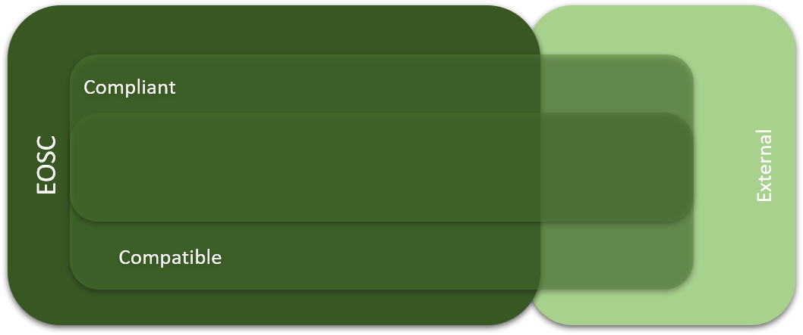

Stakeholders and Resources
==========================

Stakeholders
------------

Through the EOSCPilot Engagement activities, we have established a range
of different stakeholder who would participate in and would both benefit
from and provide benefits to the EOSC[^1]. Any effective governance
structure would need to involve and take input from all these
stakeholders. The key classes of stakeholder identified with the
community is outlined in Table 3.

<table>
<thead>
<tr class="header">
<th>Stakeholder Group</th>
<th>Description</th>
</tr>
</thead>
<tbody>
<tr class="odd">
<td> Researchers</td>
<td>The European Open Science Cloud (EOSC) will offer Europe's researchers and science and technology professionals a virtual environment to store, share and reuse the large volumes of information generated by the big data revolution. EOSC, as a functional embodiment of the European Cloud Initiative, will support data-driven innovation and contribute to the creation of a Digital Single Market in Europe. Science and industry will obviously benefit from these developments.</td>
</tr>
<tr class="even">
<td>Service Providers</td>
<td>
<strong>Service Providers are the heart of EOSC's value proposition</strong>

<strong>Service Providers functioning nationally or at a larger scale, with commercial, non-profit or public status, can have 2 roles in the EOSC: builders or providers.</strong>
</td>
</tr>
<tr class="odd">
<td> Research Producing Organisations, Academic Institutions and Research Libraries</td>
<td>
Research producing organisations, Academic Institutions and Research Libraries will be the core users of the European Open Science Cloud.

Research libraries, archives, academic institutions, university departments and, generally, organisations that are significantly involved in promoting, supporting and enabling research-production activities, play an essential role in the research and scholarship ecosystem
</td>
</tr>
<tr class="even">
<td>Learned Societies, Research Communities, Scientific and Professional Associations</td>
<td><strong>Learned societies, research communities, scientific and professional associations are key allies to build, use and promote the EOSC</strong></td>
</tr>
<tr class="odd">
<td>Enterprise</td>
<td>Enterprises relate to the EOSC in multiple ways. EOSC’s target group is categorized into a wide range of categories such as Small and Medium sized (SMEs), large enterprises, dynamic European start-ups and entrepreneurs-to-be, researchers, developers, deployers, providers, distributors, etc. Additionally, many sectors can benefit or contribute to the EOSC, for example healthcare, transportation, energy, manufacturing, education, analytics, etc.</td>
</tr>
<tr class="even">
<td>Research Infrastructures</td>
<td>
<strong>The notion of Research Infrastructures refers both to traditional large physical installations, as well as to distributed facilities which “include networked resources and skill / capacity building initiatives. These resources use advances in information and communications technology and the big data revolution to underpin new collaborative methods of research”.</strong>

<strong>Research infrastructures may be based at a single location, distributed across several sites and organisations, or provided via online platforms. Europe hosts several large-scale research infrastructures operating across national boundaries.</strong>

<strong>Research Infrastructures are the base on which the future federated EOSC will be built. They provide several types of services to the EOSC, including data services and expertise. Research infrastructures are often very experienced in providing cloud services to researchers, and as such, are key players in the specification and the set-up of the EOSC. Close cooperation with other research infrastructures and e-Infrastructures within the EOSC will increase the capability of research infrastructures to combine and integrate data and resources in a common environment.</strong>
</td>
</tr>
<tr class="odd">
<td>E-infrastructures, VREs and other pertinent H2020 projects</td>
<td>
E-Infrastructures, VREs and other H2020 projects are key building blocks of the European Open Science Cloud

The EC Digital Single Market refers to E-Infrastructures as ways of addressing needs of European researchers for digital services in terms of networking, computing and data management. They foster the emergence of Open Science and support the circulation of knowledge in Europe online and therefore constitute an essential building block for the European Research Area.

Virtual Research Environments (VRE) help researchers from all disciplines to work collaboratively by managing the increasingly complex range of tasks involved in carrying out research on both small and large scales, and consists of the tools and technologies needed by researchers to do their research, interact with other researchers (who may come from different disciplines, institutions or even countries) and to make use of resources and technical infrastructures available. Some examples of VREs are EVER-EST<a href="#fn1" class="footnote-ref" id="fnref1">1</a>, a VRE for research on Earth-science; VRE4EIC<a href="#fn2" class="footnote-ref" id="fnref2">2</a>, supporting a multi-disciplinary approach to research on climate change and energy sustainability; D4Science<a href="#fn3" class="footnote-ref" id="fnref3">3</a>, a Data Infrastructure hosting over 100 VREs; and BlueBridge<a href="#fn4" class="footnote-ref" id="fnref4">4</a>, a gateway to over 60 VREs.
</td>
</tr>
<tr class="even">
<td>General Public / Citizen Scientists</td>
<td><strong>EOSC project will create a cross-border and multi-disciplinary open innovation environment with the aim of delivering its benefits to the final citizen as well. Democratization of science and open access to scientific data are indirectly providing their beneficial results to civil society. The activities and achievements of the EOSC and open science initiatives need to be linked with the everyday challenges, that citizens are sensitive to, such as public investments, new services and new job opportunities.</strong></td>
</tr>
<tr class="odd">
<td>National, Regional or Local Government Agencies </td>
<td>Public authorities and government agencies, specifically in their capacity as organisations performing monitoring activities and using research, shall be able to fully exploit the possibilities around Big Data as EOSC will allow them to move, share and reuse data seamlessly across European borders, among institutions and analytical facilities and between different research and data disciplines</td>
</tr>
<tr class="even">
<td>Research Funding Bodies</td>
<td>
<strong>Research funding bodies are key stakeholders for the development of the EOSC. In recognition of this, they were among the first to be involved in extensive discussions with the European Commission’s High-Level Expert Group in 2016 with a view to contribute to the initial recommendations on the realization of the EOSC.</strong>

<strong>Several bodies at the European level make research grants available to researchers regardless of their nationality or field of research. This includes programmes supported by the EU under the Research and Innovation Framework programmes – including for example the direct actions of the Joint Research Centre, or the Marie Skłodowska-Curie Actions or the actions managed by the European Research Council. Other European funding programmes are managed by the European Science Foundation, the European University Institute, the European Association of National Metrology Institutes (EURAMET), etc.</strong>

<strong>Many European countries have one or more national agencies responsible for research, science and/or technology development. The policies and mandates of these agencies will inevitably be different from country to country, but they are essential drivers of Open Science and it is vital for the EOSC to engage in a common platform with these stakeholders.</strong>
</td>
</tr>
</tbody>
</table>
<section class="footnotes">

<ol>
<li id="fn1">
<a href="https://ever-est.eu/">https://ever-est.eu/</a><a href="#fnref1" class="footnote-back">↩</a>
</li>
<li id="fn2">
<a href="https://www.vre4eic.eu/">https://www.vre4eic.eu/</a><a href="#fnref2" class="footnote-back">↩</a>
</li>
<li id="fn3">
<a href="https://www.d4science.org/">https://www.d4science.org/</a><a href="#fnref3" class="footnote-back">↩</a>
</li>
<li id="fn4">
<a href="http://www.bluebridge-vres.eu/">http://www.bluebridge-vres.eu/</a><a href="#fnref4" class="footnote-back">↩</a>
</li>
</ol>
</section>

Table 3 - EOSC Stakeholders

The framework concentrates on three stakeholder *roles*, understanding
that different stakeholders can play multiple roles, or different roles
are different points in the research lifecycle or within their
organisation. These are outlined in Table 4 (the stakeholders listed are
indicative and not meant to be exhaustive or exclusive).

<table>
<thead>
<tr class="header">
<th>Primary Role</th>
<th>Description</th>
<th>Typical Stakeholders</th>
</tr>
</thead>
<tbody>
<tr class="odd">
<td><strong>Provider</strong></td>
<td><strong>Provides services, data or other resources (e.g. scientific instruments, training) into EOSC</strong></td>
<td>
<strong>e-Infrastructures</strong>

<strong>Enterprises</strong>

<strong>Academic Institutions and Research Libraries</strong>

<strong>Research Infrastructures</strong>

<strong>VREs, and other H2020 Projects</strong>

<strong>Other Service Providers</strong>
</td>
</tr>
<tr class="even">
<td><strong>Consumer</strong></td>
<td><strong>Will make use of services, data, or other resources from EOSC</strong></td>
<td>
<strong>Learned Societies, Research Communities, Scientific and Professional Associations</strong>

<strong>Research Infrastructures</strong>

<strong>Research Producing Organisations</strong>

<strong>e-Infrastructures, VRE, and Other H2020 Projects</strong>

<strong>Academic Institutions and Research Libraries</strong>

<strong>Enterprises</strong>

<strong>General Public</strong>
</td>
</tr>
<tr class="odd">
<td><strong>Decision-makers</strong></td>
<td><strong>Will be involved in the strategic direction, compliance and funding of EOSC</strong></td>
<td>
<strong>National, Regional or Local Government Agencies</strong>

<strong>Research Funding Bodies</strong>
</td>
</tr>
</tbody>
</table>

Table 4 - EOSC Primary Stakeholder Roles

In addition, there are some additional roles which are covered by the
above stakeholders, but worth explicitly articulating – these are in
Table 5.

| Supplementary Role        | Description                                                                                                                                                                                                         | Relationship to Primary Roles           |
|---------------------------|---------------------------------------------------------------------------------------------------------------------------------------------------------------------------------------------------------------------|-----------------------------------------|
| **Value-added providers** | **Many stakeholders (including e-infrastructures, research infrastructures, VREs etc.) will consume services and resources from some providers to provide value added services and resources to other consumers. ** | Within both Provider and Consumer roles |
| **Funders**               | **Provides funding for research on a local, national or international level**                                                                                                                                       | Sub-role within Decision-makers         |
| **Policy-makers**         | **Regulates policy at a local, national or regional level.**                                                                                                                                                        | Sub-role within Decision-makers         |

Table 5 - EOSC Supplementary Stakeholder Roles

Resources
---------

### Definition of EOSC Resource

**EOSC Resource = Services + Data + People**

At the centre of EOSC are the EOSC Resources themselves – the EOSC
Resources cover the range of services and facilities needed to support
Open Science and Research. These include technical services such as
analytics and computational services, cloud services, thematic services
tuned to particular research disciplines, e-infrastructure and
middleware services such as access identity management; but also
knowledge resources such as datasets, storage, digital library and
archives; access services such as a service catalogue and portals;
scientific instruments and facilities; and facilitation activities such
as training, software development support and consultancy.

### Compliance and Compatibility

It is envisaged that most of the EOSC resources will be fully
*compliant* with the Rules of Participation and, where applicable,
compatible with the technical architecture. However, it is likely that,
at least initially, there will be resources which are not fully
*compliant* but are merely technically *compatible* with the EOSC but
are still of value to the EOSC Consumers. Such resources might meet the
needs of specific disciplines only, or may be currently in the process
of becoming compliant, or transitioning into the EOSC.

There may also be some resources which may not be fully technically
*compatible* with EOSC resources nor fully *compliant* with the Rules of
Participation, but which nevertheless outside are of value to EOSC
consumers. These would still be usable by EOSC consumers as recommended
by the HLEG that *“It should be clear that non-EOSC approved players are
free to explore any role in the Open Science ecosystem they wish, even
if they do not adhere to the Rules of Participation. They will just not
be able to brand their services as EOSC approved/certified”.*

This is illustrated below in Figure 6. The EOSCPilot has co-developed an
initial set of Rules of Participation[^2] with the community, as well as
developed a technical architecture[^3] which provide more precise
definitions of *compliant* and *compatible*.

Figure 6 - EOSC Resource Model: Rules of Participation

### Open Market and Financial Flows

To function, there will need to be some **Core
Resources** underpinning the EOSC analogous to services the
internet such as domain naming services etc. . Such resources might
include the EOSC service catalogue, access and identity management, etc.
The need for **Core Resources** was also identified by the OSPP EOSC
Working Group[^4] whose definition is “set of services and processes
that are needed to integrate and enable access to the various resources
federated in the EOSC”. The **Core Resources** will need to be directly
commissioned and financially compensated. The **Executive** should have
the primary responsibility, in discussion with the **Strategic** and
**Stakeholder** layers, to determine the requirements of these core
resources, and decide how they will be delivered.

In order to meet the objective of “free at the point of use”, resource
provision will need to receive **Compensation** and financial support by other
means[^5]. Various models of this compensation could include
contribution of resources by member states and institutions, direct
commission by the **Executive** or compensation based on usage using
mechanism in the Framework Programmes (such as Transnational or Virtual
Access instruments[^6]) or new mechanisms such as “Cloud Coins” or other
credit mechanisms. Facilities and services to enable such credit
mechanisms will need to be provided by the EOSC **Core** **Resources**.

To ensure that the EOSC remains relevant and to encourage innovation, it
will be necessary to identify any **Resource
Gaps** which may exist may in provision. Gaps may be identified
by the **Stakeholder** or **Executive** layers and notified to the
**Executive** and **Strategic** layers. The **Executive** will need to
develop mechanisms to fill any such gaps in provision, either by
directly incentivising the development of new resources and services or
through advocacy to the Strategic layer and the Framework Programmes.
This may also need to include incentives to transition existing
resources into the EOSC, may providing mechanisms to help resource
providers meet the technical requirements and Rules of Participation.

To ensure that EOSC remains an **Open
Market** “open to all players, public and private, European and
non-European” (as required by the first HLEG report[^7]), there may also
be resources within EOSC which will not be directly compensated through
EOSC, but through other means (including commercial resources paid
directly by researchers or their institutions), but which nevertheless
meet the requirements to be EOSC *compliant* or *compatible* and are of
value to the community.

In summary (as illustrated in Figure 6):

-   An EOSC Resource is *Compliant* if it meets the Rules of
    Participation for the EOSC

-   An EOSC Resource is *Compatible* if it meets the technical
    requirements as defined by the EOSC technical architecture

-   Some resources which are needed to integrate and enable access to
    the various resources federated in the EOSC will be *Core Resources*
    (which, by definition, will need to be *Compliant*)

-   *Compliant* resources will be eligible to be part of EOSC; resources
    neither *Compliant* nor *Compatible* will be external to EOSC;
    *Compatible* only resources might be borderline (if, for instance,
    they are transitioning into EOSC)

-   EOSC resources (both commercial and non-commercial) might be
    compensated for their usage via mechanisms within EOSC; some EOSC
    resources might be funded via other means, including commercial
    models

Figure 7 - EOSC Resource Model: Economics

[^1]: See “D8.2: Stakeholder Identification & Engagement Strategy Plan”
    at <https://www.eoscpilot.eu/media/deliverables>

[^2]: See “D2.5: Recommendations for a minimal set of Rules of
    Participation” at <https://www.eoscpilot.eu/media/deliverables>

[^3]: See “D5.1: Initial EOSC Service Architecture” at
    <https://www.eoscpilot.eu/media/deliverables>

[^4]: <https://ec.europa.eu/research/openscience/pdf/ospp_euro_open_science_cloud_report-.pdf>

[^5]: See also “D2.4: Recommendations and prerequisites to realise EOSC
    as a sustainable ecosystem“ at
    <https://www.eoscpilot.eu/media/deliverables>

[^6]: <http://www.rich2020.eu/tas_calls/about>

[^7]: <https://ec.europa.eu/research/openscience/pdf/realising_the_european_open_science_cloud_2016.pdf>

