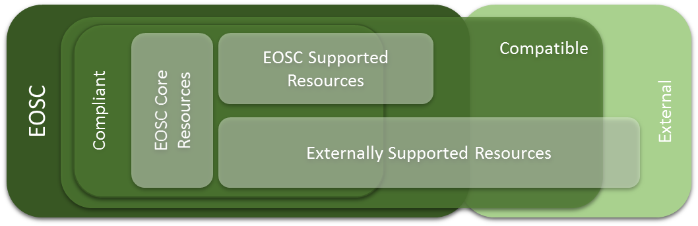
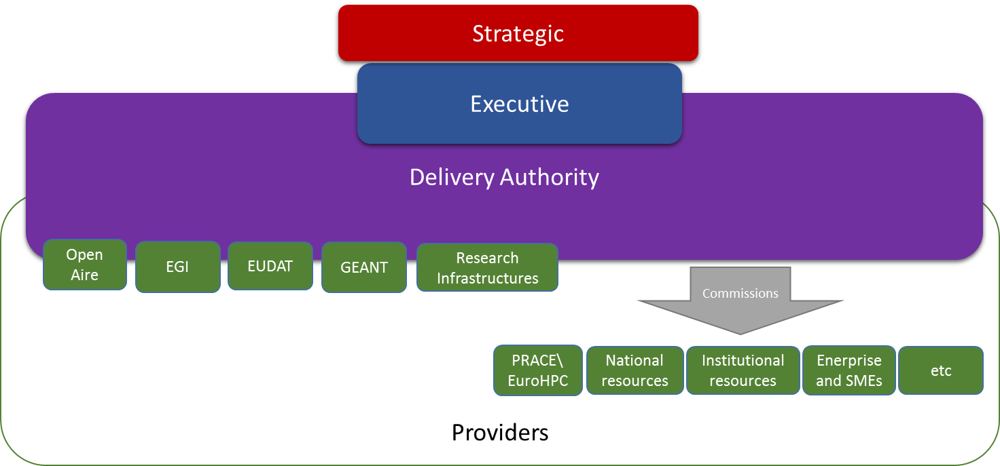

StakeholderS and Resources
==========================

Stakeholders
------------

Through the EOSCPilot Engagement activities, we have established a range
of different stakeholder who would participate in and would both benefit
from and provide benefits to the EOSC. Any effective governance
structure would need to involve and take input from all these
stakeholders. The key classes of stakeholder identified with the
community is outlined in Table 2.

+-----------------------------------+-----------------------------------+
| {width="0.39370078 | (EOSC) will offer Europe\'s       |
| 74015748in"                       | researchers and science and       |
| height="0.3937007874015748in"}    | technology professionals a        |
| Researchers                       | virtual environment to store,     |
|                                   | share and reuse the large volumes |
|                                   | of information generated by the   |
|                                   | big data revolution. EOSC, as a   |
|                                   | functional embodiment of the      |
|                                   | European Cloud Initiative, will   |
|                                   | support data-driven innovation    |
|                                   | and contribute to the creation of |
|                                   | a Digital Single Market in        |
|                                   | Europe. Science and industry will |
|                                   | obviously benefit from these      |
|                                   | developments.                     |
+===================================+===================================+
| {width="0.39370078 | of EOSC\'s value proposition**    |
| 74015748in"                       |                                   |
| height="0.3937007874015748in"}Ser | **Service Providers functioning   |
| vice                              | nationally or at a larger scale,  |
| Providers                         | with commercial, non-profit or    |
|                                   | public status, can have 2 roles   |
|                                   | in the EOSC: builders or          |
|                                   | providers.**                      |
+-----------------------------------+-----------------------------------+
| {width="0.39370078 | Academic Institutions and         |
| 74015748in"                       | Research Libraries will be the    |
| height="0.3937007874015748in"}    | core users of the European Open   |
| Research Producing Organisations, | Science Cloud.                    |
| Academic Institutions and         |                                   |
| Research Libraries                | Research libraries, archives,     |
|                                   | academic institutions, university |
|                                   | departments and, generally,       |
|                                   | organisations that are            |
|                                   | significantly involved in         |
|                                   | promoting, supporting and         |
|                                   | enabling research-production      |
|                                   | activities, play an essential     |
|                                   | role in the research and          |
|                                   | scholarship ecosystem             |
+-----------------------------------+-----------------------------------+
| Learned Societies, Research       | **Learned societies, research     |
| Communities, Scientific and       | communities, scientific and       |
| Professional                      | professional associations are key |
| Associations{width | the EOSC**                        |
| ="0.3937007874015748in"           |                                   |
| height="0.3937007874015748in"}    |                                   |
+-----------------------------------+-----------------------------------+
| {width="0.39370078 | multiple ways. EOSC's target      |
| 74015748in"                       | group is categorized into a wide  |
| height="0.3937007874015748in"}Ent | range of categories such as Small |
| erprise                           | and Medium sized (SMEs), large    |
|                                   | enterprises, dynamic European     |
|                                   | start-ups and                     |
|                                   | entrepreneurs-to-be, researchers, |
|                                   | developers, deployers, providers, |
|                                   | distributors, etc. Additionally,  |
|                                   | many sectors can benefit or       |
|                                   | contribute to the EOSC, for       |
|                                   | example healthcare,               |
|                                   | transportation, energy,           |
|                                   | manufacturing, education,         |
|                                   | analytics, etc.                   |
+-----------------------------------+-----------------------------------+
| {width="0.39370078 | Infrastructures refers both to    |
| 74015748in"                       | traditional large physical        |
| height="0.3937007874015748in"}Res | installations, as well as to      |
| earch                             | distributed facilities which      |
| Infrastructures                   | "include networked resources and  |
|                                   | skill / capacity building         |
|                                   | initiatives. These resources use  |
|                                   | advances in information and       |
|                                   | communications technology and the |
|                                   | big data revolution to underpin   |
|                                   | new collaborative methods of      |
|                                   | research".**                      |
|                                   |                                   |
|                                   | **Research infrastructures may be |
|                                   | based at a single location,       |
|                                   | distributed across several sites  |
|                                   | and organisations, or provided    |
|                                   | via online platforms. Europe      |
|                                   | hosts several large-scale         |
|                                   | research infrastructures          |
|                                   | operating across national         |
|                                   | boundaries.**                     |
|                                   |                                   |
|                                   | **Research Infrastructures are    |
|                                   | the base on which the future      |
|                                   | federated EOSC will be built.     |
|                                   | They provide several types of     |
|                                   | services to the EOSC, including   |
|                                   | data services and expertise.      |
|                                   | Research infrastructures are      |
|                                   | often very experienced in         |
|                                   | providing cloud services to       |
|                                   | researchers, and as such, are key |
|                                   | players in the specification and  |
|                                   | the set-up of the EOSC. Close     |
|                                   | cooperation with other research   |
|                                   | infrastructures and               |
|                                   | e-Infrastructures within the EOSC |
|                                   | will increase the capability of   |
|                                   | research infrastructures to       |
|                                   | combine and integrate data and    |
|                                   | resources in a common             |
|                                   | environment.**                    |
+-----------------------------------+-----------------------------------+
| E-infrastructures, VREs and other | E-Infrastructures, VREs and other |
| pertinent H2020                   | H2020 projects are key building   |
| projects{width="0. | Science Cloud                     |
| 3937007874015748in"               |                                   |
| height="0.3937007874015748in"}    | The EC Digital Single Market      |
|                                   | refers to E-Infrastructures as    |
|                                   | ways of addressing needs of       |
|                                   | European researchers for digital  |
|                                   | services in terms of networking,  |
|                                   | computing and data management.    |
|                                   | They foster the emergence of Open |
|                                   | Science and support the           |
|                                   | circulation of knowledge in       |
|                                   | Europe online and therefore       |
|                                   | constitute an essential building  |
|                                   | block for the European Research   |
|                                   | Area.                             |
|                                   |                                   |
|                                   | A Virtual Research Environment    |
|                                   | (VRE) is a community of practice, |
|                                   | an organisation and a bundle of   |
|                                   | services which supports           |
|                                   | researchers by providing access   |
|                                   | to shared documents tools and     |
|                                   | resources they need during a      |
|                                   | research project. Some examples   |
|                                   | of VREs are EVER-EST, a VRE for   |
|                                   | research on Earth-science, and    |
|                                   | VRE4EIC, supporting a             |
|                                   | multi-disciplinary approach to    |
|                                   | research on climate change and    |
|                                   | energy sustainability.            |
+-----------------------------------+-----------------------------------+
| {width="0.39370078 | cross-border and                  |
| 74015748in"                       | multi-disciplinary open           |
| height="0.3937007874015748in"}Gen | innovation environment with the   |
| eral                              | aim of delivering its benefits to |
| Public                            | the final citizen as well.        |
|                                   | Democratization of science and    |
|                                   | open access to scientific data    |
|                                   | are indirectly providing their    |
|                                   | beneficial results to civil       |
|                                   | society. The activities and       |
|                                   | achievements of the EOSC and open |
|                                   | science initiatives need to be    |
|                                   | linked with the everyday          |
|                                   | challenges, that citizens are     |
|                                   | sensitive to, such as public      |
|                                   | investments, new services and new |
|                                   | job opportunities.**              |
+-----------------------------------+-----------------------------------+
| National, Regional or Local       | Public authorities and government |
| Government Agencies               | agencies, specifically in their   |
| {width="0.39370078 | performing monitoring activities  |
| 74015748in"                       | and using research, shall be able |
| height="0.3937007874015748in"}    | to fully exploit the              |
|                                   | possibilities around Big Data as  |
|                                   | EOSC will allow them to move,     |
|                                   | share and reuse data seamlessly   |
|                                   | across European borders, among    |
|                                   | institutions and analytical       |
|                                   | facilities and between different  |
|                                   | research and data disciplines     |
+-----------------------------------+-----------------------------------+
| Research Funding                  | **Research funding bodies are key |
| Bodies{width="0.3 | of the EOSC. In recognition of    |
| 937007874015748in"                | this, they were among the first   |
| height="0.3937007874015748in"}    | to be involved in extensive       |
|                                   | discussions with the European     |
|                                   | Commission's High-Level Expert    |
|                                   | Group in 2016 with a view to      |
|                                   | contribute to the initial         |
|                                   | recommendations on the            |
|                                   | realization of the EOSC.**        |
|                                   |                                   |
|                                   | **Several bodies at the European  |
|                                   | level make research grants        |
|                                   | available to researchers          |
|                                   | regardless of their nationality   |
|                                   | or field of research. This        |
|                                   | includes programmes supported by  |
|                                   | the EU under the Research and     |
|                                   | Innovation Framework programmes   |
|                                   | -- including for example the      |
|                                   | direct actions of the Joint       |
|                                   | Research Centre, or the Marie     |
|                                   | Skłodowska-Curie Actions or the   |
|                                   | actions managed by the European   |
|                                   | Research Council. Other European  |
|                                   | funding programmes are managed by |
|                                   | the European Science Foundation,  |
|                                   | the European University           |
|                                   | Institute, the European           |
|                                   | Association of National Metrology |
|                                   | Institutes (EURAMET), etc.**      |
|                                   |                                   |
|                                   | **Many European countries have    |
|                                   | one or more national agencies     |
|                                   | responsible for research, science |
|                                   | and/or technology development.    |
|                                   | The policies and mandates of      |
|                                   | these agencies will inevitably be |
|                                   | different from country to         |
|                                   | country, but they are essential   |
|                                   | drivers of Open Science and it is |
|                                   | vital for the EOSC to engage in a |
|                                   | common platform with these        |
|                                   | stakeholders.**                   |
+-----------------------------------+-----------------------------------+

Table 3 - EOSC Stakeholders

The framework concentrates on three stakeholder *roles*, understanding
that different stakeholders can play multiple roles, or different roles
are different points in the research lifecycle or within their
organisation. These are outlined in Table 3 (the stakeholders listed are
indicative and not meant to be exhaustive or exclusive).

+-----------------------+-----------------------+-----------------------+
| Primary Role          | Description           | Typical Stakeholders  |
+=======================+=======================+=======================+
| Provider              | **Provides services,  | **e-Infrastructures** |
|                       | data or other         |                       |
|                       | resources (e.g.       | **Service Providers** |
|                       | scientific            |                       |
|                       | instruments,          | **Enterprise**        |
|                       | training) into EOSC** |                       |
|                       |                       | **Academic            |
|                       |                       | Institutions and      |
|                       |                       | Research Libraries**  |
|                       |                       |                       |
|                       |                       | **Research            |
|                       |                       | Infrastructures**     |
|                       |                       |                       |
|                       |                       | **Outputs from VRE,   |
|                       |                       | and Other H2020       |
|                       |                       | Projects**            |
+-----------------------+-----------------------+-----------------------+
| Consumer              | **Will make use of    | **Learned Societies,  |
|                       | services, data, or    | Research Communities, |
|                       | other resources from  | Scientific and        |
|                       | EOSC**                | Professional          |
|                       |                       | Associations**        |
|                       |                       |                       |
|                       |                       | **Research            |
|                       |                       | Infrastructures**     |
|                       |                       |                       |
|                       |                       | **Research Producing  |
|                       |                       | Organisation**        |
|                       |                       |                       |
|                       |                       | **e-Infrastructures,  |
|                       |                       | VRE, and Other H2020  |
|                       |                       | Projects**            |
|                       |                       |                       |
|                       |                       | **Academic            |
|                       |                       | Institutions and      |
|                       |                       | Research Libraries**  |
|                       |                       |                       |
|                       |                       | **Enterprise**        |
|                       |                       |                       |
|                       |                       | **General Public**    |
+-----------------------+-----------------------+-----------------------+
| Decision-makers       | **Will be involved in | **National, Regional  |
|                       | the strategic         | or Local Government   |
|                       | direction, compliance | Agencies**            |
|                       | and funding of EOSC** |                       |
|                       |                       | **Research Funding    |
|                       |                       | Bodies**              |
+-----------------------+-----------------------+-----------------------+

Table 4 - EOSC Primary Stakeholder Roles

In addition, there are some additional roles which are covered by the
above stakeholders, but worth explicitly articulating -- these are in
Table 4.

  Supplementary Role      Description                                                                                                                                                                               Relationship to Primary Roles
  ----------------------- ----------------------------------------------------------------------------------------------------------------------------------------------------------------------------------------- --------------------------------------------
  Value-added providers   **Many stakeholders (including e-infrastructures, research infrastructures, VREs etc.) will consume services from some providers to provide value added services to other consumers. **   Member of both Provider and Consumer roles
  Funders                 **Provides funding for research on a local, national or international level**                                                                                                             Sub-role within Decision-makers
  Policy-makers           **Regulates policy at a local, national or regional level.**                                                                                                                              Sub-role within Decision-makers

Table 5 - EOSC Supplementary Stakeholder Roles

Resources
---------

### Resources

**EOSC Resource = Services + Data + People**

At the centre of this model are the EOSC Resources themselves -- the
EOSC Resources cover the range of services and facilities needed to
support Open Science and Research. These include technical services such
as analytics and computational services, cloud services, thematic
services tuned to particular research disciplines, e-infrastructure and
middleware services such as access identity management; but also
knowledge resources such as datasets, storage, digital library and
archives; access services such as a service catalogue and portals;
scientific instruments and facilities; and facilitation activities such
as training, software development support and consultancy.

### Compliance and Compatibility

It is envisaged that most of the EOSC resources will be fully
*compliant* with the Principles of Engagement and compatible with the
technical architecture. However, it is likely that, at least initially,
there will be resources which are not fully *compliant* but are merely
technically *compatible* with the EOSC but are still of value to the
EOSC Consumers. Such resources might meet the needs of specific
disciplines only, or may be currently in the process of becoming
compliant.

There may also be some resources which may not be fully technically
*compatible* with EOSC resources nor fully *compliant* with the
Principles of Engagement, but which nevertheless outside are of value to
EOSC consumers. These would still be usable by EOSC consumers as
recommended by the HLEG that "It should be clear that non-EOSC approved
players are free to explore any role in the Open Science ecosystem they
wish, even if they do not adhere to the Principles of Engagement. They
will just not be able to brand their services as EOSC
approved/certified".

This is illustrated below. The EOSCPilot has co-developed Rules of
Participation with the community, as well as developed a technical
architecture which provide more precise definitions of *compliant* and
*compatible*.

{width="5.833333333333333in"
height="2.4425010936132985in"}

Figure 8 - EOSC Resource Model: Rules of Participation

###  {#section .ListParagraph}

### Core Resources

To function, there will need to be some **Core Resources** underpinning
the EOSC analogous to the Logical Layer in the Digital Governance for
the Internet (**Error! Reference source not found.**). Such resources
might include the EOSC service catalogue, access and identity
management, etc. The need for **Core Resources** was also identified by
the OSPP EOSC Working Group (see Section 2.3) whose definition is "set
of services and processes that are needed to integrate and enable access
to the various resources federated in the EOSC". The **Core Resources**
will need to be directly commissioned and financially compensated. The
**Executive** should have the primary responsibility, in discussion with
the **Strategic** and **Stakeholder** layers, to determine the
requirements of these core resources, and decide how they will be
delivered.

### Compensation

In order to meet the objective of "free at the point of use", resource
provision will need to be compensated by other means. The EOSCPilot is
currently working on Business and Funding Models on how this
compensation would work, but various models could include contribution
of resources by member states and institutions, direct commission by the
**Executive** or compensation based on usage using mechanism in the
Framework Programmes (such as Transnational or Virtual Access
instruments[^1]) or new mechanisms such as "Cloud Coins" or other credit
mechanisms. Facilities and services to enable such credit mechanisms
will need to be provided by the EOSC **Core** **Resources**.

### Service Gaps 

To ensure that the EOSC remains relevant and to encourage innovation, it
will be necessary to identify any gaps there may be in provision. Gaps
may be identified by **Stakeholder** or **Executive** layer and notified
to the Executive and Strategic layers. The **Executive** will need to
develop mechanisms to fill any such gaps in provision, either by
directly incentivising the development of new services or through
advocacy to the Strategic layer and the Framework Programmes.

### Open Market

To ensure that EOSC remains "open to all players, public and private,
European and non-European" (Section 2.2), there may also be resources
within EOSC which will not be directly compensated through EOSC, but
through other means (including commercial resources paid directly by
researchers or their institutions), but which nevertheless meet the
requirements to be EOSC *compliant* or *compatible* and are of value to
the community.

In summary (see also **Error! Reference source not found.**):

-   An EOSC Resource is *Compliant* if it meets the Principles of
    Engagement and the technical requirements as defined by the EOSC
    technical architecture

-   An EOSC Resource is *Compatible* if it meets the technical
    requirements as defined by the EOSC technical architecture

-   Some resources which are needed to integrate and enable access to
    the various resources federated in the EOSC will be *Core Resources*
    (which by definition will need to be *Compliant*)

-   *Compliant* resources will be eligible to be part of EOSC; resources
    neither *Compliant* nor *Compatible* will be external to EOSC;
    *Compatible* only resources might be borderline (if, for instance,
    they are transitioning into EOSC)

-   EOSC resources (both commercial and non-commercial) might be
    compensated for their usage via mechanisms within EOSC; some EOSC
    resources might be funded via other means, including commercial
    models

{width="5.905511811023622in"
height="1.9133858267716535in"}

Figure 9 - EOSC Resource Model: Economics

Resource Delivery Models
------------------------

There are broadly three potential models for the EOSC to commission and
provide financial support to Core and Supported EOSC Resources. Earlier
models can be regarded as intermediate steps towards later model as well
as potential final models.

### Lightweight Delivery Model

Executive commissions and pays for (either directly or through some
compensatory mechanism) Core and Supported services from international,
national, institutional and commercial providers through existing
mechanisms (e.g. Framework Programme instruments such as Virtual Access)

{width="5.511811023622047in"
height="2.751968503937008in"}

Figure 10 -- Light Weight Executive Delivery Model

+-----------------------------------+-----------------------------------+
| Pros                              | Cons                              |
+===================================+===================================+
| Minimal Impact on present         | Little impact of possibility to   |
| structures                        | change services of present        |
|                                   | providers                         |
| Maintains existing entry points   |                                   |
|                                   | Slow change cycle                 |
| Maintained Subsidiarity principle |                                   |
| (that access should be through    | Would need collaboration          |
| local or national institutions)   | agreements                        |
|                                   |                                   |
| Fast to implement                 |                                   |
|                                   |                                   |
| Present funding mechanisms can be |                                   |
| used                              |                                   |
|                                   |                                   |
| Flexible and agile in terms of    |                                   |
| providers                         |                                   |
+-----------------------------------+-----------------------------------+

Table 6 -- Light Weight Executive Delivery Model: Pros and Cons

### Commissioning Authority

The establishment of a new entity (possibly a legal structure such as an
ERIC) who would have responsibility for commissioning (e.g. contracting
or framework agreements) Core and Supported Resources.

{width="5.511811023622047in"
height="2.751968503937008in"}

Figure 11 - Medium Weight Executive Delivery Model

+-----------------------------------+-----------------------------------+
| Pros                              | Cons                              |
+===================================+===================================+
| Clean interface between funder    | Require major agreement between   |
| and provider                      | Member States and European        |
|                                   | Commission                        |
| From providers' perspective, a    |                                   |
| new business opportunity          | Slow to implement                 |
|                                   |                                   |
| An ERIC structure would allow     | Breaks Subsidiarity Principle by  |
| additional mechanisms for Member  | providing centralised provision   |
| State contributions/              | of national or local resources    |
+-----------------------------------+-----------------------------------+

Table 7 -- Medium Weight Executive Delivery Model: Pros and Cons

### Delivery Authority

The establishment of a new entity (possibly a legal structure such as an
ERIC) who would have responsibility for delivering Core and Supported
Resources, either directly or through contracting or framework
agreements with third parties.

{width="5.511811023622047in"
height="2.574803149606299in"}

Figure 12 -- Heavy Weight Executive Delivery Model

+-----------------------------------+-----------------------------------+
| Pros                              | Cons                              |
+===================================+===================================+
| Organisational integration        | Artificially tight integration of |
| between public European           | very different business models    |
| e-infrastructures                 |                                   |
|                                   | Very long time to implement       |
|                                   |                                   |
|                                   | Needs strong coordination of      |
|                                   | national resources                |
+-----------------------------------+-----------------------------------+

[^1]: http://www.rich2020.eu/tas\_calls/about
