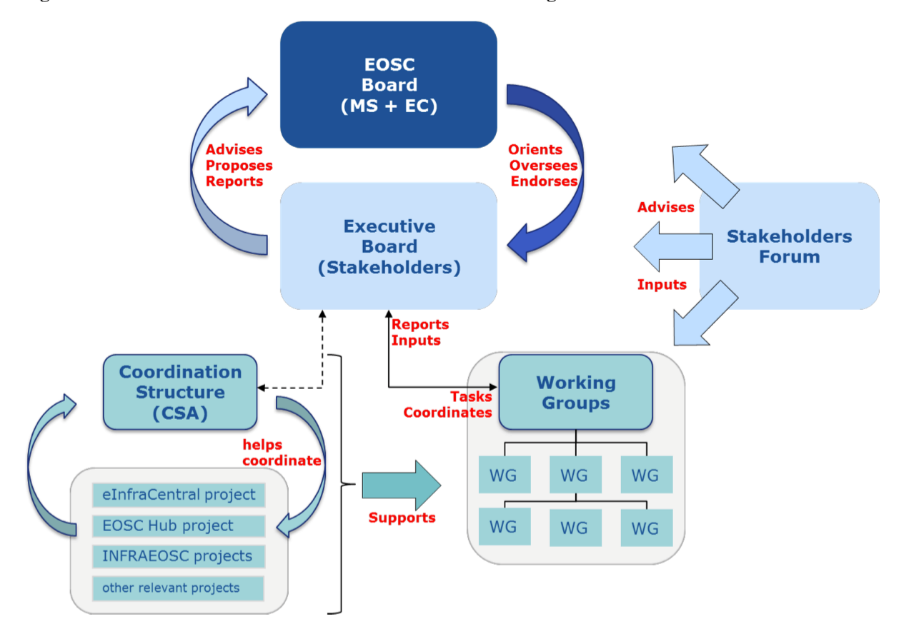
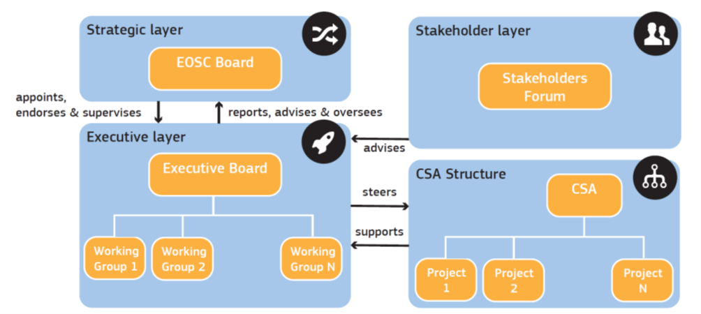
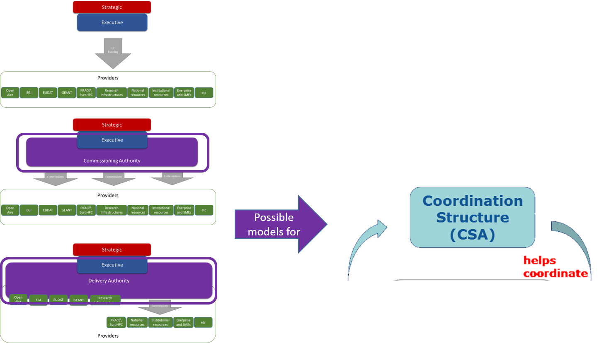

Strategic Requirements 
=======================

European Cloud Initiative Communication
---------------------------------------

On the 19^th^ April 2016, the European Commission published a
communication on the “European Cloud Initiative - Building a competitive
data and knowledge economy in Europe”[^1]. This document outlined the
vision of the European Open Science Cloud as:

“The European Open Science Cloud aims to give Europe a global lead in
scientific data infrastructures, to ensure that European scientists reap
the full benefits of data-driven science. Practically, it will offer 1.7
million European researchers and 70 million professionals in science and
technology a virtual environment with free at the point of use, open and
seamless services for storage, management, analysis and re-use of
research data, across borders and scientific disciplines. Its
development will be driven by the scientific community, who are the most
advanced users and the largest producers of science in the world. The
European Open Science Cloud will be also open for education and training
purposes in higher education and, over time, to government and business
users as the technologies developed will be promoted for wider
application. “

The Communication gives the following requirement for the EOSC
Governance structure:

“Create **a fit-for-purpose pan-European governance structure** to
federate scientific data infrastructures and overcome fragmentation**.**
The institutional set-up will oversee long-term funding, sustainability,
data preservation and stewardship. It will build on existing structures
to involve scientific users, research funders and implementers”.

First HLEG Report
-----------------

The second key policy document for the European Open Science Cloud is
the first High Level Expert Group report published on the 11^th^ October
2016[^2]. This makes various recommendations on policy, governance, and
implementation to take immediate action on the EOSC in close concert
with Member States, building on existing capacity and expertise. Its
recommendations on governance are as follows:

1.  **Aim at the lightest possible, internationally effective
    governance**. Given the urgency and the number and variety of
    stakeholders and participants required to realise the EOSC, a
    tightly governed, new infrastructure built 'somewhere' is not the
    right model for the EOSC to be a success. Instead a more inclusive,
    flexible, transparent and less centralised approach is required, one
    that also enables effective global collaboration. The Commission
    needs to establish a lightweight, sustainable and collaborative
    governance model for the EOSC for all players to contribute.

2.  **Guidance only where guidance is due**. While we advocate
    lightweight governance, we need a degree of regulation. For
    instance, the harmonisation of the current 'standards jungle' needs
    to be actively coordinated. With no regulation, some major players,
    public and private, may claim an unjust and counterproductive share
    in the EOSC. The EOSC will have a myriad of small and very large
    players, as is the case in the current internet, but it should be
    perceived by regulators and stockholders alike as a “commons” where
    citizens, researchers and innovators need to use each other's data
    and tools in a trusted affordable and sustainable environment.
    Europe should take a lead in this due guidance element of the
    Internet of FAIR Data and Services.

3.  **Define Rules of Engagement for service provision in the EOSC.** To
    support wide participation, innovation and sustainability the EOSC
    needs to be open to all players, public and private, European and
    non-European and the development of the desired expert
    infrastructure will be guided and governed by a minimal set of
    rigorously applied and enforced protocols and developed by parties
    that endorse so called Principles of Engagement (PoE) that specify
    the conditions under which stakeholders participate. These PoE can
    be used to brand providers in the EOSC as trustworthy and compliant
    with the PoE, comparable to Conformant Cloud Providers in the USA.
    It should be clear that non-EOSC approved players are free to
    explore any role in the Open Science ecosystem they wish, even if
    they do not adhere to the PoE. They will just not be able to brand
    their services as EOSC approved/certified.

4.  **Federate the gems (and amplify good practice).** Based on the
    consensus that most foundational building blocks of the Internet of
    FAIR data and Services are operational somewhere, but that they
    operate in silos per domain, geographical region and funding scheme,
    we recommend that early and strong action is taken to federate these
    gems. Optimal engagement is required of the e-infrastructure
    communities, the ESFRI communities and other disciplinary groups and
    institutes. Several of these cross-ESFRI building blocks begin to
    operate in individual Member States. Simultaneously, the wealth of
    small and large industrial players in Europe should be engaged. All
    partners and stakeholders that adhere to standards and sign off on
    the Principles of Engagement (PoE) should be eligible.

Open Science Policy Platform
----------------------------

In May 2017, the Open Science Policy Platform[^3] adopted a “Report on
the governance and financial schemes for the European Open Science
Cloud” from its working group on the EOSC[^4]. This report was submitted
to the EU Competitiveness Council. It recommends that:

1.  The EOSC should rely on a multi-level and multi-stakeholder
    governance that ensures a representation for the main stakeholder
    categories and disciplines, integrating both the national and
    European levels of authority.

2.  Facilitate access to the EOSC across borders and disciplines by
    carefully analysing all aspects of interoperability (technical,
    semantic, organisational, legal and policy) and translate them into
    a common model and rules of participation.

3.  European countries and EC should ensure long-term funding of the
    services that are needed to enable the integration of and access to
    the resources that can be federated in the EOSC.

4.  Different and innovative funding schemes should be investigated to
    support users to consume services from EOSC-certified providers that
    are approved based on a commonly-agreed European certification
    scheme.

5.  Kick-off the EOSC ecosystem with enough coordinated financial
    support from a sufficiently large set of European countries and the
    EC.

6.  Raise awareness and communicate benefits of the EOSC among decision
    makers, research and education bodies, private sector, industrial
    and citizen organisations; share best practices and use-cases to
    highlight the potential and results of the EOSC.

7.  Develop Open Science and data skills among all the key stakeholder
    categories.

8.  Ensure to align and develop ethical rules in data management,
    storage and analytics that are recognized by all stakeholders in the
    EOSC.

EOSC Declaration
----------------

The EOSC Declaration, published by the EC on 24/10/17 is an outcome of
the EOSC Summit of 12th June 2017 that was attended by eighty key
stakeholders. The EOSC Declaration sets out key principles on Data
Culture and FAIR Data; Research Data Architectures and Services; and
Governance and Funding[^5]. The key principles for governance are:

1.  **Governance model** - A long-term, sustainable research
    infrastructure in Europe requires a strong and flexible governance
    model based on trust and increasing mutuality. As
    interdisciplinarity is one of the main objectives of the EOSC, the
    governance model should be based on representability,
    proportionality, accountability, inclusiveness and transparency.

2.  **Governance framework** - The EOSC governance framework will be
    co-designed, stakeholder driven and composed of three main
    layers: 1) institutional, including EU Member States and European
    Commission 2) operational, including a governance board and relevant
    working committees (e.g. thematic and functional) and 3) advisory,
    including a stakeholder forum.

3.  **Governance board** - A governance board will coordinate the
    efforts of stakeholders endorsing the EOSC Declaration, with the
    broad mandate to reach practical agreements for the implementation
    of an EOSC Roadmap by 2020. The board will have an advisory role and
    an implementing role of the decisions by Member States and European
    Commission concerning the programming, financing and towards the
    setting up of a long-term governance and business model for the
    EOSC. It will make best use of the outcomes of past and current
    projects (e.g. EOSCpilot, eInfraCentral and EOSC-hub) and
    independent expert advice and studies.

4.  **Coordination structure** - A coordination structure, funded by
    Horizon 2020, will help the governance board to manage the
    implementation, according to agreed rules and methods of stakeholder
    participation. The structure and its participating entities should
    be accountable for the responsibilities assumed, based on an
    objective assessment of their level of readiness in delivering the
    EOSC main functionalities.

5.  **Global aspects** - The EOSC will be European and open to the
    world, reaching out over time to relevant global research partners.
    It will increase the global value of open research data and support
    stakeholder engagement, including researchers and citizens. It will
    gradually widen the initiative to federated network of
    infrastructures and nodes from global research partners. The EOSC
    Stakeholder Forum will have an important role in this sense.

EC Staff Working Document
-------------------------

The European Commission’s staff working document **"Implementation
Roadmap for the European Open Science Cloud"**[^6] outlines an interim
governance structure for the initial implementation phase of the EOSC.
It is envisaged that this can transition to the framework described in
the deliverable

Figure 4 - Staff Working Document Governance Structure

There are two main differences between these the SWD framework and the
one in this document:

-   one is in the role of the INSTITUTIONAL layer. The SWD is very
    carefully detailing the role of the EOSC Board- they are the
    decision making body, but they also decide who is in the Executive
    board and who is in the Advisory layer.

-   the second difference is in the importance and the function of the
    advisory layer. While SWD has very little to say about this,
    minimizing the importance of the stakeholder forum, EOSCPilot
    emphasized their importance. EOSCPilot also puts a lot of emphasis
    on the relationships and information flow, the communication between
    the layers.

In addition, EOSCpilot working groups are part of the Stakeholder
Engagement Model created and populated governed by the Stakeholder
Engagement Governance; SWD working groups are part of the Executive
(created and governed by Executive; populated by executive from the
stakeholder forum)

<table>
<thead>
<tr class="header">
<th><strong> </strong></th>
<th><strong>EOSCpilot DGF</strong></th>
<th><strong>EC SWD</strong></th>
</tr>
</thead>
<tbody>
<tr class="odd">
<td><strong>INSTITUTIONAL</strong></td>
<td>Name: Strategic</td>
<td>Name: EOSC Board</td>
</tr>
<tr class="even">
<td></td>
<td>Members: MS + EC</td>
<td>Members: MS + EC (DG RTD and DG CNECT)</td>
</tr>
<tr class="odd">
<td></td>
<td>
Function:

<ul>
<li>
defines strategic objectives
</li>
<li>
measure the impact and effectiveness of EOSC
</li>
</ul></td>
<td>
Function:

<ul>
<li>
ensures effective supervision of the implementation
</li>
<li>
decides strategic orientation of EOSC and commitment and financial support
</li>
<li>
institutional and political oversight
</li>
<li>
approves members of Executive Board
</li>
<li>
approves annual workplan
</li>
<li>
assesses progress of EOSC implementation
</li>
<li>
coordinates with other MS/EC initiatives
</li>
</ul></td>
</tr>
<tr class="even">
<td><strong>EXECUTIVE</strong></td>
<td>Name: Executive</td>
<td>Name: Executive Board (+ Coordination Structure?)</td>
</tr>
<tr class="odd">
<td></td>
<td>Members: not clear</td>
<td>Members: max. 10 chosen by the EOSC Board from ESFRI infras, eInfras, scientific organisations, university associations etc.</td>
</tr>
<tr class="even">
<td></td>
<td>
Function:

<ul>
<li>
ensures EOSC delivers to meet the needs of the Stakeholders
</li>
</ul></td>
<td>
Function:

<ul>
<li>
ensures proper implementation and accountability
</li>
<li>
proposes the strategy &amp; workplan
</li>
<li>
drafts the Rules of Participation
</li>
<li>
oversees and steer the implementation of the workplan together with the working groups (WGs)
</li>
<li>
monitors the implementation of EOSC (by 2020)
</li>
<li>
proposes how broaden user base to public sector and industry
</li>
</ul></td>
</tr>
<tr class="odd">
<td><strong>ADVISORY</strong></td>
<td>Name: Steering (incl. Stakeholder Forum)</td>
<td>Name: Advisory (Stakeholder Forum)</td>
</tr>
<tr class="even">
<td></td>
<td>Members: individuals including organisations\institutional representatives; multiple subforums (consumers, providers etc.)</td>
<td>Members: broad participation by organisations\institutions\communities (possibly decided by EOSC Board), single representative per organisation\institution\community – requires adherence to the principles of EOSC</td>
</tr>
<tr class="odd">
<td></td>
<td>
Function:

<ul>
<li>
Recommends\proposes within communities best practices, standards, principles of engagement
</li>
<li>
Recommends\proposes “Rules of Engagement for service provision in the EOSC” from HLEG group report
</li>
<li>
Recommends\proposes scientific and technical requirements of the EOSC
</li>
</ul></td>
<td>
Function:

<ul>
<li>
Intelligence gathering and Consultative role
</li>
<li>
Expertise but no decision-making body
</li>
</ul></td>
</tr>
</tbody>
</table>

Table 1 - Governance Crosswalk

Despite the differences, there is a clear evolutionary path between the
two models, with the Stakeholder Forum taking a stronger role in
determining the direction of EOSC to ensure that it that it meets its
users’ needs, and in particular taking over the running of working
groups, whilst the Executive adopts a more operational and delivery
role.

Figure 5 - Governance Transition

In addition, the coordinating structure would evolve into a delivery
model for EOSC resources and services.

Figure 6 - Delivery Transition

Second HLEG Report
------------------

The report of the Second High Level Expert Group on the Open Science
Cloud (Prompting an EOSC in Practice)[^7], supports the SWD governance
model for the initial implementation of the EOSC as outlined below:

Figure 7 - 2nd HLEG Governance Overview

[^1]: https://ec.europa.eu/digital-single-market/en/news/communication-european-cloud-initiative-building-competitive-data-and-knowledge-economy-europe

[^2]: https://ec.europa.eu/research/openscience/pdf/realising\_the\_european\_open\_science\_cloud\_2016.pdf

[^3]: https://ec.europa.eu/research/openscience/index.cfm?pg=open-science-policy-platform

[^4]: https://ec.europa.eu/research/openscience/pdf/ospp\_euro\_open\_science\_cloud\_report-.pdf

[^5]: https://ec.europa.eu/research/openscience/pdf/eosc\_declaration.pdf

[^6]: [http://ec.europa.eu/research/openscience/pdf/swd\_2018\_83\_f1\_staff\_workin...](http://ec.europa.eu/research/openscience/pdf/swd_2018_83_f1_staff_working_paper_en.pdf)

[^7]: https://publications.europa.eu/en/web/eu-law-and-publications/publication-detail/-/publication/5253a1af-ee10-11e8-b690-01aa75ed71a1

