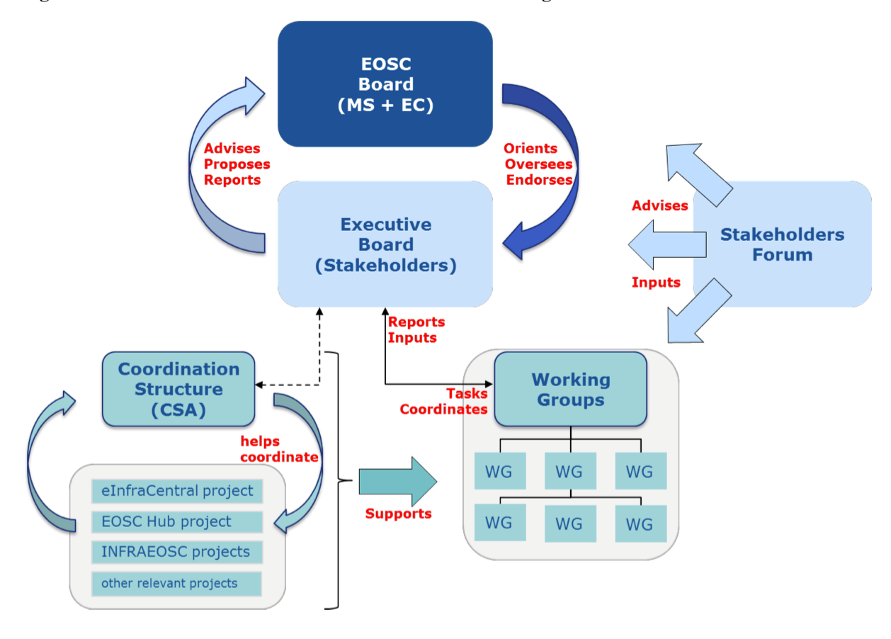
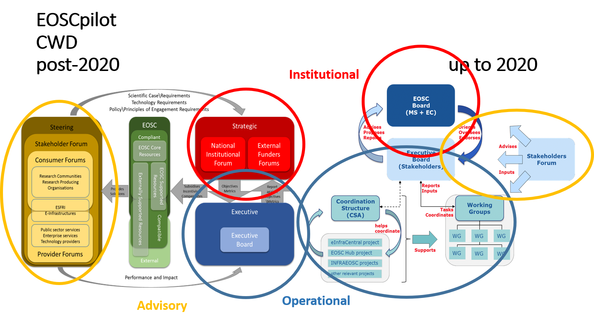

EOSC Transition Model
---------------------

The EOSCPilot Governance Framework (EGF) proposes a Governance structure after the initial implementation period of EOSC (i.e. post 2020). The European Commission Staff Working Document (SWD) proposes a Governance structure for the initial implementation of the EOSC.

There are two very big differences between these frameworks: 
* one is in the role of the INSTITUTIONAL layer. The EC group is very carefully detailing the role of the EOSC Board, making sure it is clear to everybody who is the boss. They are the decision making body, but they also decide who is in the Executive board and who gets to be in the Advisory layer. 
* the second difference is in the importance and the function of the advisory layer. While SWD has very little to say about this, minimizing the importance of the stakeholder forum, EOSCpilot emphasized their importance.   EOSCpilot also puts a lot of emphasis on the relationships and information flow, the communication between the layers etc

In addition, EOSCpilot working groups are part of the Stakeholder Engagement Model created and populated governed by the Stakeholder Engagement Governance; SWD working groups are part of the Executive (created and governed by Executive; populated by executive from the stakeholder forum)

<table>
<tr><td> ** ** </td><td>**EOSCpilot EGF**</td><td>**EC SWD**</td></tr>
<tr><td>**INSTITUTIONAL**</td><td>Name: Strategic</td><td>Name: EOSC Board</td></tr>
  <tr><td></td><td>Members: MS + EC</td><td>Members: MS + EC (DG RTD and DG CNECT)</td></tr>
  <tr><td></td><td>Function:
<ul>
  <li>defines strategic objectives</li>
  <li>measure the impact and effectiveness of EOSC</li>
</ul>
  </td><td>Function:
  <ul>
<li>ensures effective supervision of the implementation</li>
<li>decides strategic orientation of EOSC and commitment and financial support</li>
<li>institutional and political oversight</li>
<li>approves members of Executive Board</li>
<li>approves annual workplan</li>
    <li>assesses progress of EOSC implementation</li>
    <li>coordinates with other MS/EC initiatives</li></ul></td></tr>
  <tr><td> **EXECUTIVE** </td><td> Name: Executive </td><td> Name: Executive Board (+ Coordination Structure?) </td></tr>
  <tr><td></td><td> Members: not clear </td><td> Members: max. 10 chosen by the EOSC Board from ESFRI infras, eInfras, scientific organisations, university associations etc. </td></tr>
  <tr><td></td><td>Function:
    <ul>
      <li>ensures EOSC delivers to meet the needs of the Stakeholders</li></ul> </td><td> Function:
<ul>
  <li>ensures proper implementation and accountability</li>
  <li>proposes the strategy &amp; workplan</li>
  <li>drafts the Rules of Participation</li>
  <li>oversees and steer the implementation of the workplan together with the working groups (WGs)</li>
  <li>monitors the implementation of EOSC (by 2020)</li>
  <li>proposes how broaden user base to public sector and industry</li></ul> </td></tr>
  <tr><td> **ADVISORY** </td><td> Name: Steering (incl. Stakeholder Forum) </td><td> Name: Advisory (Stakeholder Forum) </td></tr>
  <tr><td></td> Members: individuals including organisations\institutional representatives; multiple subforums (consumers, providers etc.) </td><td> Members: broad participation by organisations\institutions\communities (possibly decided by EOSC Board), single representative per organisation\institution\community – requires adherence to the principles of EOSC </td></tr>
<tr><td></td><td> Function:
  <ul>
<li>Recommends\proposes within communities best practices, standards, principles of engagement</li>
<li>Recommends\proposes &quot;Rules of Engagement for service provision in the EOSC&quot; from HLEG group report</li>
    <li>Recommends\proposes scientific and technical requirements of the EOSC</li></ul> </td><td> Function:
  <ul><li>Intelligence gathering and Consultative role</li>
  <li>Expertise but no decision-making body</li></ul> </td></tr>
</table>

Despite the differences, there is a clear evolutionary path between the two models, with the Stakeholder Forum taking a stronger role in determining the direction of EOSC to ensure that it that it meets its users needs, and in particular taking over the running of working groups, whilst the Executive adopts a more operational and delivery role.

In addition the coordinating structure would evolve into a delivery model for EOSC resources and services.

