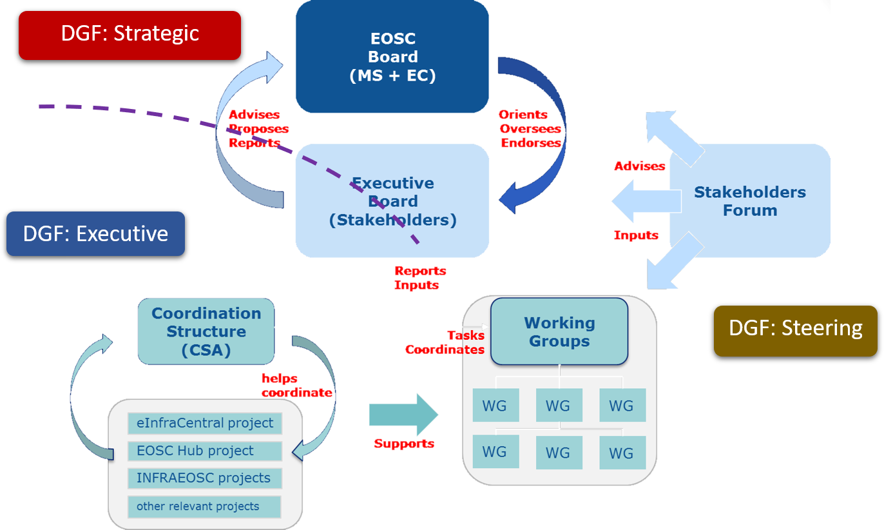
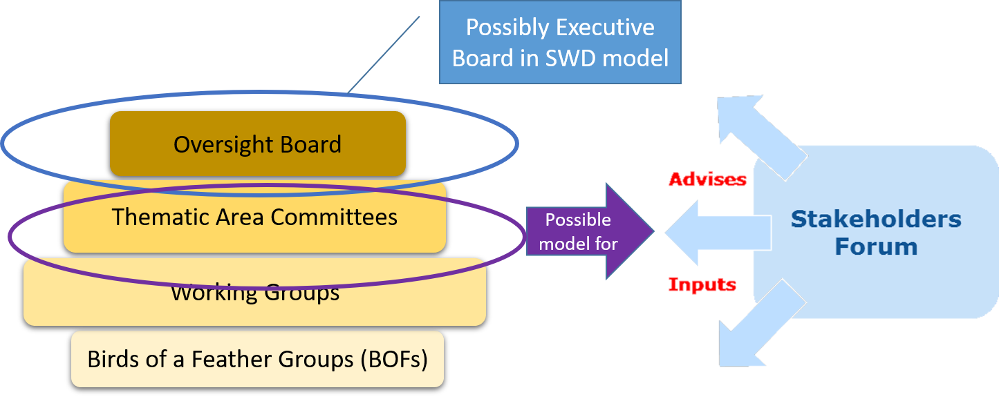

EOSC Transition Model
---------------------

 

DGF = EOSCPilot Draft Governance Framework
SWD = EC Staff Working Document

DGF Executive Board fits cleanly under Executive with an operational remit; SWG Executive Board crosses all three DGF areas and includes strategic (as MS reps etc), steering (overall governance of stakeholder forum) and executive (operational\delivery) responsibilities

DGF Stakeholder forum bottom up, comprehensive membership, includes determination of working groups (and structure for working groups) to provide recommendations (service provision, rules of participation, etc.) to Strategic

SWD Stakeholder forum top down (members defined by strategic), members are key organisations\communities (coalition of doers) not individuals.

DGF working groups are part of the stakeholder forum created and populated governed by stakeholder forum; SWD working groups are part of the Executive (created and governed by Executive; populated by executive from the stakeholder forum)

There are two very big differences between these frameworks: one is in the role of the INSTITUTIONAL layer. The EC group is very carefully detailing the role of the EOSC Board, making sure it is clear to everybody who is the boss. They are the decision making body, but they also decide who is in the Executive board and who gets to be in the Advisory layer. The second difference is in the importance and the function of the advisory layer. While CWD has very little to say about this, minimizing the importance of the stakeholder forum, EOSCpilot emphasized their importance.   EOSCpilot also puts a lot of emphasis on the relationships and information flow, the communication between the layers etc

EOSCpilot working groups are part of the stakeholder forum created and populated governed by stakeholder forum; SWD working groups are part of the Executive (created and governed by Executive; populated by executive from the stakeholder forum)

The thematic area committees concept for the stakeholder forum within DGF might provide a model for the structure of the SWD stakeholder forum

SWD expects the executive to perform the oversight role

If EOSC is a legal entity then the medium and heavy weight delivery models in DGF probably apply – these roughly map functionally onto the SWD CSA (in the long term i.e. post 2020). SWD is still considering the initial implementation (up to 2020) of EOSC.
